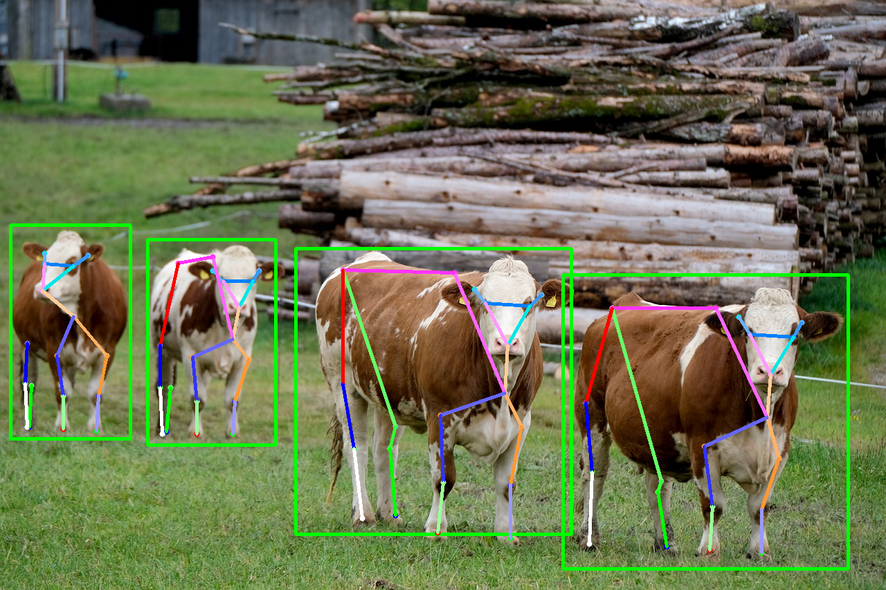

# MMPose - 2D animal pose estimation

## Input


(Image from https://github.com/open-mmlab/mmpose/blob/master/tests/data/animalpose/ca110.jpeg)

Shape : (1, 3, 256, 256)

## Output

### result without detector



### result with detector


## Usage
Automatically downloads the onnx and prototxt files on the first run.
It is necessary to be connected to the Internet while downloading.

For the sample image,
```bash
$ python3 animalpose.py
```

If you want to specify the input image, put the image path after the `--input` option.  
You can use `--savepath` option to change the name of the output file to save.
```bash
$ python3 animalpose.py --input IMAGE_PATH --savepath SAVE_IMAGE_PATH
```

By adding the `--video` option, you can input the video.   
If you pass `0` as an argument to VIDEO_PATH, you can use the webcam input instead of the video file.
```bash
$ python3 animalpose.py --video VIDEO_PATH
```

By specifying the `--detector` option, apply the detector.
The yolov3 is used as detector.
```bash
$ python3 animalpose.py --detector
```

## Reference

- [MMPose](https://github.com/open-mmlab/mmpose) 

## Framework

Pytorch

## Model Format

ONNX opset=11

## Netron

[hrnet_w32_256x256.onnx.prototxt](https://netron.app/?url=https://storage.googleapis.com/ailia-models/animalpose/hrnet_w32_256x256.onnx.prototxt)  
[hrnet_w48_256x256.onnx.prototxt](https://netron.app/?url=https://storage.googleapis.com/ailia-models/animalpose/hrnet_w48_256x256.onnx.prototxt)  
[res50_256x256.onnx.prototxt](https://netron.app/?url=https://storage.googleapis.com/ailia-models/animalpose/res50_256x256.onnx.prototxt)  
[res101_256x256.onnx.prototxt](https://netron.app/?url=https://storage.googleapis.com/ailia-models/animalpose/res101_256x256.onnx.prototxt)  
[res152_256x256.onnx.prototxt](https://netron.app/?url=https://storage.googleapis.com/ailia-models/animalpose/res152_256x256.onnx.prototxt)  
[yolov3.opt.onnx.prototxt](https://netron.app/?url=https://storage.googleapis.com/ailia-models/yolov3/yolov3.opt.onnx.prototxt)  
