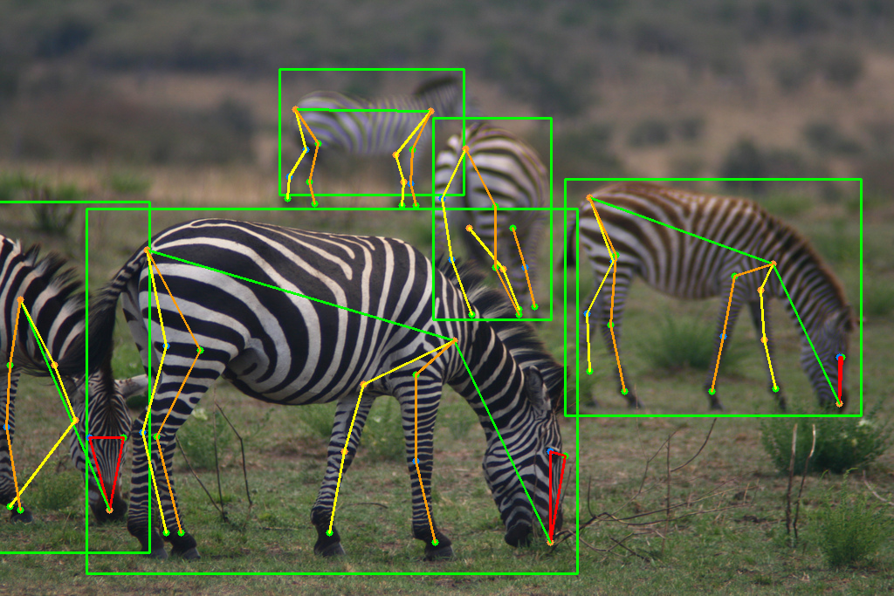

# AP-10K: A Benchmark for Animal Pose Estimation in the Wild

## Input


(Image from AP-10K dataset 000000030718.jpg https://github.com/AlexTheBad/AP-10K)

Shape : (1, 3, 256, 256)

## Output



## Usage
Automatically downloads the onnx and prototxt files on the first run.
It is necessary to be connected to the Internet while downloading.

For the sample image,
```bash
$ python3 ap-10k.py
```

If you want to specify the input image, put the image path after the `--input` option.  
You can use `--savepath` option to change the name of the output file to save.
```bash
$ python3 ap-10k.py --input IMAGE_PATH --savepath SAVE_IMAGE_PATH
```

By adding the `--video` option, you can input the video.   
If you pass `0` as an argument to VIDEO_PATH, you can use the webcam input instead of the video file.
```bash
$ python3 ap-10k.py --video VIDEO_PATH
```

By default, yolov3 and hrnet32 are used. You can use other model by specifying hrnet48, res50, res101 in `-m` option and yolox_m in `-d` option.
```bash
$ python3 ap-10k.py -d yolox_m -m hrnet48
```

## Reference

- [AP-10K](https://github.com/AlexTheBad/AP-10K) 

## Framework

Pytorch

## Model Format

ONNX opset=11

## Netron

[hrnet_w32_ap10k_256x256.onnx.prototxt](https://netron.app/?url=https://storage.googleapis.com/ailia-models/ap-10k/hrnet_w32_ap10k_256x256.onnx.prototxt)  
[hrnet_w48_ap10k_256x256.onnx.prototxt](https://netron.app/?url=https://storage.googleapis.com/ailia-models/ap-10k/hrnet_w48_ap10k_256x256.onnx.prototxt)  
[res50_ap10k_256x256.onnx.prototxt](https://netron.app/?url=https://storage.googleapis.com/ailia-models/ap-10k/res50_ap10k_256x256.onnx.prototxt)  
[res101_ap10k_256x256.onnx.prototxt](https://netron.app/?url=https://storage.googleapis.com/ailia-models/ap-10k/res101_ap10k_256x256.onnx.prototxt)  
[yolov3.opt.onnx.prototxt](https://netron.app/?url=https://storage.googleapis.com/ailia-models/yolov3/yolov3.opt.onnx.prototxt)  
[yolox_m.opt.onnx.prototxt](https://netron.app/?url=https://storage.googleapis.com/ailia-models/yolox/yolox_m.opt.onnx.prototxt)  
