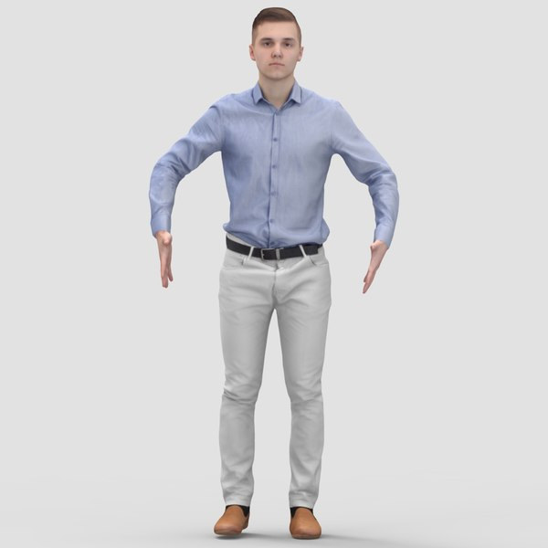

# BlazePose

## Input



(Image from https://www.turbosquid.com/ja/3d-models/3ds-max-realistic-human-pose/897233)

### Detector

- ailia input shape: (1, 3, 128, 128)  
- Range:

### Estimator

- ailia input shape: (1, 3, 256, 256)

## Output


### Detector

- ailia Predict API output:

### Estimator
- ailia Predict API output:
  - Segmentation
    - Shape: (1, 1, 128, 128)
  - Landmarks
    - Shape: (1, 31, 4)
    - 25 upper-body keypoints (x, y, z, visibility) + 2 virtual keypoints (x, y, z, visibility) + 4 ??? face bounding boxes (x, y, z, visibility)?
  - Flag
    - Shape: (1,)
## Usage
Automatically downloads the onnx and prototxt files on the first run.
It is necessary to be connected to the Internet while downloading.

For the sample image,
``` bash
$ python3 blazepose.py 
```

If you want to specify the input image, put the image path after the `--input` option.  
You can use `--savepath` option to change the name of the output file to save.
```bash
$ python3 blazepose.py --input IMAGE_PATH --savepath SAVE_IMAGE_PATH
```

By adding the `--video` option, you can input the video.   
If you pass `0` as an argument to VIDEO_PATH, you can use the webcam input instead of the video file.
```bash
$ python3 blazepose.py --video VIDEO_PATH --savepath SAVE_VIDEO_PATH
```

## Reference

[MediaPipePyTorch](https://github.com/zmurez/MediaPipePyTorch)

Squeeze function in Pytorch model removed as it produces an IF layer in ONNX unsupported in ailia (segmentation output has thus 1 more dim)

## Framework

PyTorch 1.7.1


## Model Format

ONNX opset = 11

