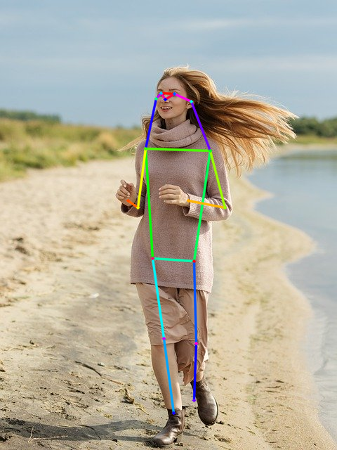

# E2Pose

## Input


(Image from https://pixabay.com/ja/photos/%E5%A5%B3%E3%81%AE%E5%AD%90-%E7%BE%8E%E3%81%97%E3%81%84-%E8%8B%A5%E3%81%84-%E3%83%9B%E3%83%AF%E3%82%A4%E3%83%88-5204299/)

## Output



## Usage
Automatically downloads the onnx and prototxt files on the first run.
It is necessary to be connected to the Internet while downloading.

For the sample image,
```bash
$ python3 e2pose.py
```

If you want to specify the input image, put the image path after the `--input` option.  
You can use `--savepath` option to change the name of the output file to save.
```bash
$ python3 e2pose.py --input IMAGE_PATH --savepath SAVE_IMAGE_PATH
```

By adding the `--video` option, you can input the video.   
If you pass `0` as an argument to VIDEO_PATH, you can use the webcam input instead of the video file.
```bash
$ python3 e2pose.py --video VIDEO_PATH
```

By adding the `--model_type` option, you can specify model type which is selected from "resnet50", "resnet101", "resnet152", "mobilenet_320", "mobilenet_448". (default is resnet101)
```bash
$ python3 e2pose.py --model_type resnet101
```

## Reference

- [E2Pose](https://github.com/AISIN-TRC/E2Pose)

## Framework

Tensorflow

## Model Format

ONNX opset=11

## Netron

[COCO_ResNet50_320x320.onnx.prototxt](https://netron.app/?url=https://storage.googleapis.com/ailia-models/e2pose/COCO_ResNet50_320x320.onnx.prototxt)  
[COCO_ResNet101_512x512.onnx.prototxt](https://netron.app/?url=https://storage.googleapis.com/ailia-models/e2pose/COCO_ResNet101_512x512.onnx.prototxt)  
[COCO_ResNet152_448x448.onnx.prototxt](https://netron.app/?url=https://storage.googleapis.com/ailia-models/e2pose/COCO_ResNet152_448x448.onnx.prototxt)  
[COCO_MobileNetV2_320x320.onnx.prototxt](https://netron.app/?url=https://storage.googleapis.com/ailia-models/e2pose/COCO_MobileNetV2_320x320.onnx.prototxt)  
[COCO_MobileNetV2_448x512.onnx.prototxt](https://netron.app/?url=https://storage.googleapis.com/ailia-models/e2pose/COCO_MobileNetV2_448x512.onnx.prototxt)
