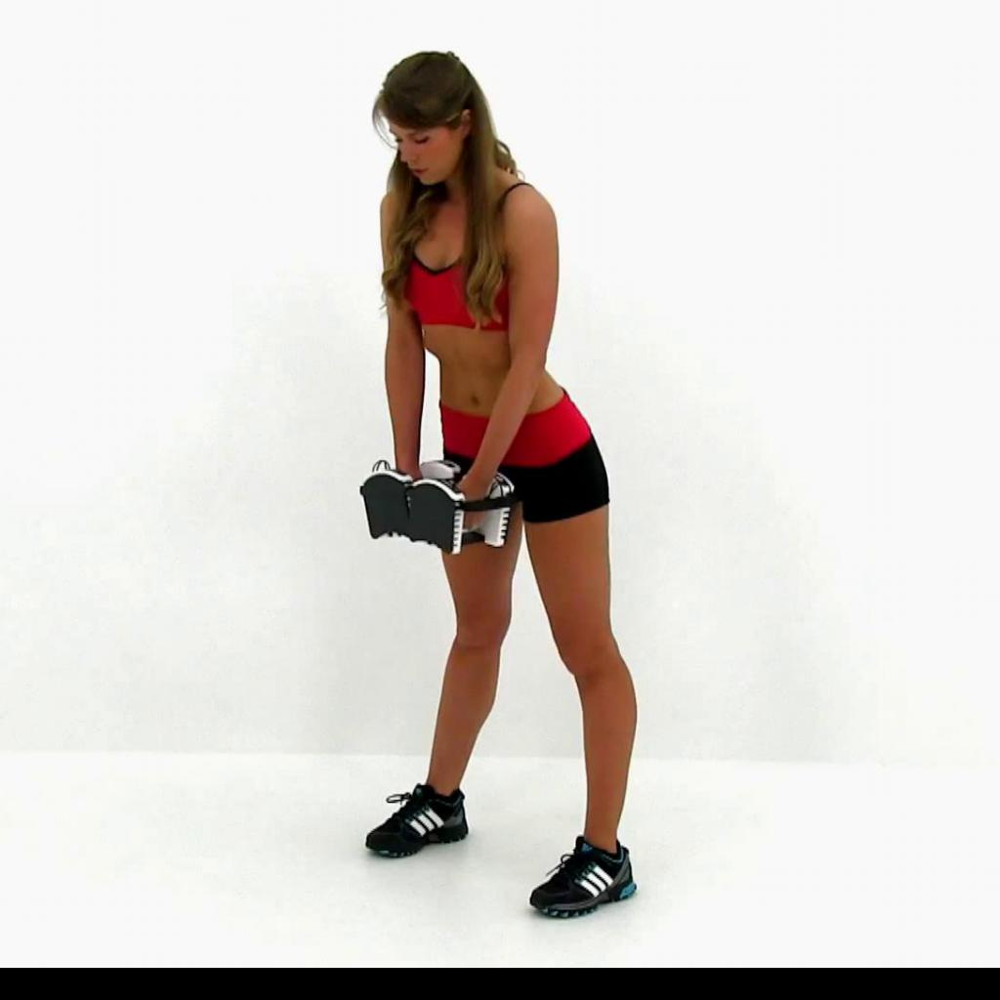
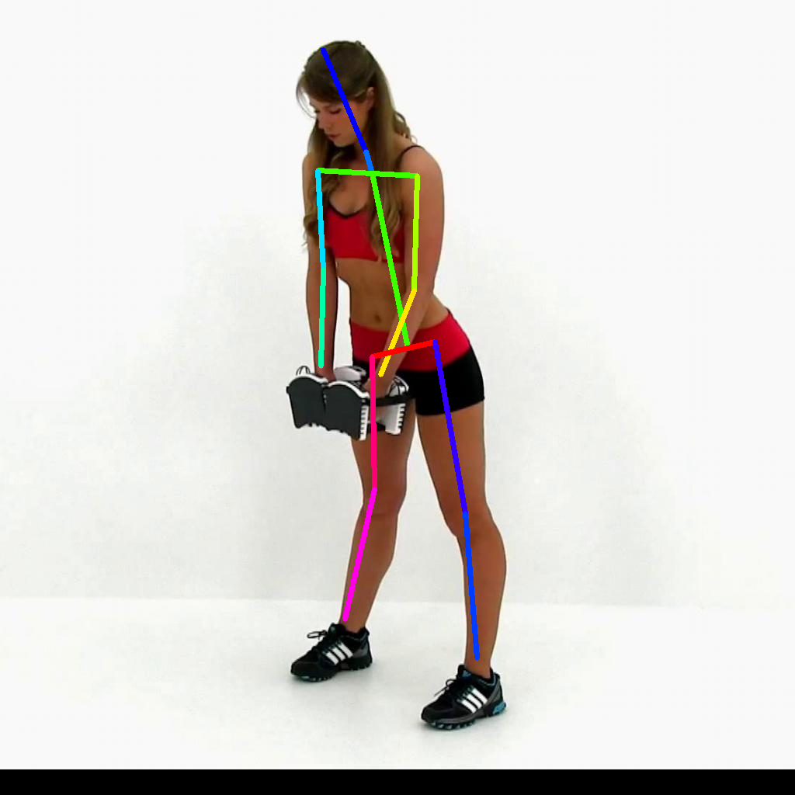

# EfficientPose

## Input



Model variant: RT
Ailia input shape : (1, 224, 224, 3)  
Range : [0, 1.0]

## Output



- Confidence : (1, 224, 224, 16)
- Range : [0, 1.0]

## Usage

Automatically downloads the onnx and prototxt files on the first run.
It is necessary to be connected to the Internet while downloading.

For the sample image,
``` bash
$ python3 efficientpose.py
```

If you want to specify the input image, put the image path after the `--input` option.  
You can use `--savepath` option to change the name of the output file to save.
```bash
$ python3 efficientpose.py --input IMAGE_PATH --savepath SAVE_IMAGE_PATH
```

If you want to specify the model variant, put the model variant after the `--model_variant` option.  
You can only choose variants from 'rt','i','ii','iii','iv'.
```bash
$ python3 efficientpose.py --input IMAGE_PATH --savepath SAVE_IMAGE_PATH --model_variant rt
```

By adding the `--video` option, you can input the video.   
If you pass `0` as an argument to VIDEO_PATH, you can use the webcam input instead of the video file.
```bash
$ python3 efficientpose.py --video VIDEO_PATH
```

## Reference

[Code repo for EfficientPose](https://github.com/daniegr/EfficientPose)

## Framework

Keras, TensorFlow, TensorFlow Lite or PyTorch

## Model Format

ONNX opset = 10

## Netron

[EfficientPoseRT.prototxt](https://netron.app/?url=https://storage.googleapis.com/ailia-models/efficientpose/EfficientPoseRT.prototxt)
[EfficientPoseI.prototxt](https://netron.app/?url=https://storage.googleapis.com/ailia-models/efficientpose/EfficientPoseI.prototxt)
[EfficientPoseII.prototxt](https://netron.app/?url=https://storage.googleapis.com/ailia-models/efficientpose/EfficientPoseII.prototxt)
[EfficientPoseIII.prototxt](https://netron.app/?url=https://storage.googleapis.com/ailia-models/efficientpose/EfficientPoseIII.prototxt)
[EfficientPoseIV.prototxt](https://netron.app/?url=https://storage.googleapis.com/ailia-models/efficientpose/EfficientPoseIV.prototxt)

