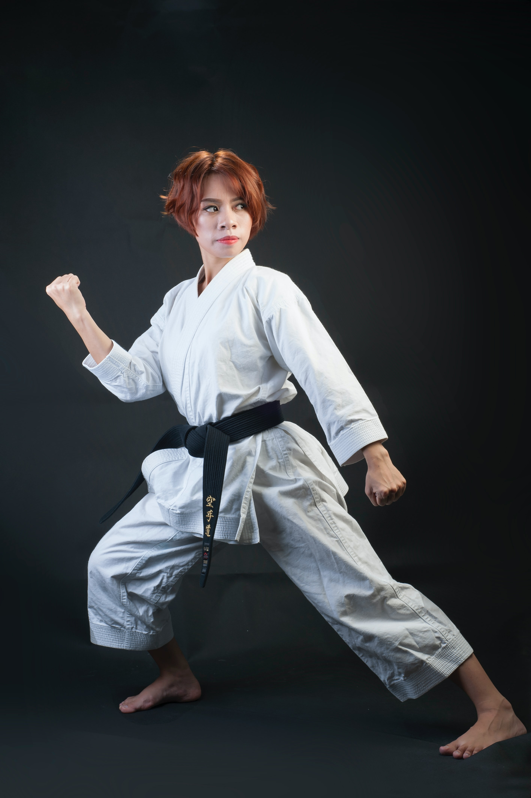

# MediaPipe Holistic

## Input



(Image from https://mediapipe.page.link/pose_py_colab)

## Output


## Usage
Automatically downloads the onnx and prototxt files on the first run.
It is necessary to be connected to the Internet while downloading.

For the sample image,
```bash
$ python3  mediapipe_holistic.py
```

If you want to specify the input image, put the image path after the `--input` option.  
You can use `--savepath` option to change the name of the output file to save.
```bash
$ python3 mediapipe_holistic.py --input IMAGE_PATH --savepath SAVE_IMAGE_PATH
```

By adding the `--video` option, you can input the video.   
If you pass `0` as an argument to VIDEO_PATH, you can use the webcam input instead of the video file.
```bash
$ python3 mediapipe_holistic.py --video VIDEO_PATH
```

By adding the `--model` option, you can specify pose model type which is selected from "lite", "full", "heavy".  
(default is full)
```bash
$ python3 mediapipe_holistic.py --model heavy
```

By adding the `--detector` option, you can add person detector model for multi person recognition.
```bash
$ python3 mediapipe_holistic.py --detector
```

By adding the `--scale` option, you can resize input image for better viewing of the output.
```bash
$ python3 mediapipe_holistic.py --scale 4
```

By adding the `--frame_skip` option, you can skip frames of input video for improve the performance.
```bash
$ python3 mediapipe_holistic.py --frame_skip 4
```

## Reference

- [MediaPipe](https://github.com/google/mediapipe)
- [MediaPipe Holistic](https://google.github.io/mediapipe/solutions/holistic.html)
- [MediaPipe Face Mesh](https://google.github.io/mediapipe/solutions/face_mesh.html)
- [MediaPipe Hands](https://google.github.io/mediapipe/solutions/hands.html)

## Framework

TensorFlow Lite

## Model Format

ONNX opset=12, 11

## Netron

[pose_detection.onnx.prototxt](https://netron.app/?url=https://storage.googleapis.com/ailia-models/mediapipe_pose_world_landmarks/pose_detection.onnx.prototxt)  
[pose_landmark_lite.onnx.prototxt](https://netron.app/?url=https://storage.googleapis.com/ailia-models/mediapipe_pose_world_landmarks/pose_landmark_lite.onnx.prototxt)  
[pose_landmark_full.onnx.prototxt](https://netron.app/?url=https://storage.googleapis.com/ailia-models/mediapipe_pose_world_landmarks/pose_landmark_full.onnx.prototxt)  
[pose_landmark_heavy.onnx.prototxt](https://netron.app/?url=https://storage.googleapis.com/ailia-models/mediapipe_pose_world_landmarks/pose_landmark_heavy.onnx.prototxt)  
[face_detection_short_range.onnx.prototxt](https://netron.app/?url=https://storage.googleapis.com/ailia-models/mediapipe_holistic/face_detection_short_range.onnx.prototxt)  
[face_landmark_with_attention.onnx.prototxt](https://netron.app/?url=https://storage.googleapis.com/ailia-models/mediapipe_holistic/face_landmark_with_attention.onnx.prototxt)  
[hand_recrop.onnx.prototxt](https://netron.app/?url=https://storage.googleapis.com/ailia-models/mediapipe_holistic/hand_recrop.onnx.prototxt)  
[hand_landmark_full.onnx.prototxt](https://netron.app/?url=https://storage.googleapis.com/ailia-models/mediapipe_holistic/hand_landmark_full.onnx.prototxt)
