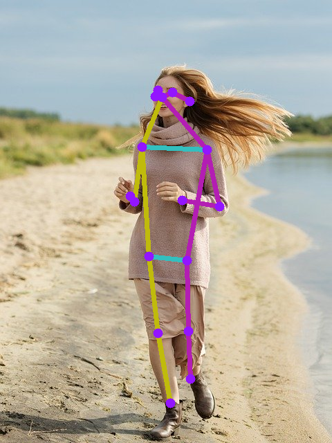

# MoveNet

## Input


(Image from https://pixabay.com/ja/photos/%E5%A5%B3%E3%81%AE%E5%AD%90-%E7%BE%8E%E3%81%97%E3%81%84-%E8%8B%A5%E3%81%84-%E3%83%9B%E3%83%AF%E3%82%A4%E3%83%88-5204299/)

Model variant: Thunder  
Ailia input shape : (1, 256, 256, 3)  
Range : [0, 1.0]

Model variant: Lightning  
Ailia input shape : (1, 192, 192, 3)  
Range : [0, 1.0]

## Output



- 2D Keypoint + Confidence : (1, 1, 17, 3)
- Range : [0, 1.0]

## Usage

Automatically downloads the onnx and prototxt files on the first run.
It is necessary to be connected to the Internet while downloading.

For the sample image,
``` bash
$ python3 movenet.py
```

If you want to specify the input image, put the image path after the `--input` option.  
You can use `--savepath` option to change the name of the output file to save.
```bash
$ python3 movenet.py --input IMAGE_PATH --savepath SAVE_IMAGE_PATH
```

If you want to specify the model variant, put the model variant after the `--model_variant` option.  
You can only choose variants from 'thunder','lightning'. default is 'thunder'
```bash
$ python3 movenet.py --input IMAGE_PATH --savepath SAVE_IMAGE_PATH --model_variant lightning
```

By adding the `--video` option, you can input the video.   
If you pass `0` as an argument to VIDEO_PATH, you can use the webcam input instead of the video file.
```bash
$ python3 movenet.py --video VIDEO_PATH
```

## Reference

[Code repo for movenet](https://www.tensorflow.org/hub/tutorials/movenet)

## Framework

TensorFlow

## Model Format

ONNX opset = 11

## Netron
[movenet_thunder.onnx.prototxt](https://netron.app/?url=https://storage.googleapis.com/ailia-models/movenet/movenet_thunder.onnx.prototxt)

[movenet_lightning.onnx.prototxt](https://netron.app/?url=https://storage.googleapis.com/ailia-models/movenet/movenet_lightning.onnx.prototxt)