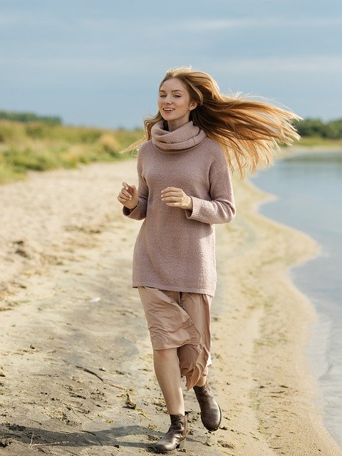
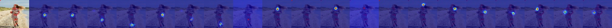

# Cross View Fusion for 3D Human Pose Estimation

## Input



(Image from https://pixabay.com/ja/photos/%E5%A5%B3%E3%81%AE%E5%AD%90-%E7%BE%8E%E3%81%97%E3%81%84-%E8%8B%A5%E3%81%84-%E3%83%9B%E3%83%AF%E3%82%A4%E3%83%88-5204299/)

Ailia input shape: (1, 3, 256, 192)

## Output



## Usage

Automatically downloads the onnx and prototxt files on the first run.
It is necessary to be connected to the Internet while downloading.

For the sample image,
``` bash
$ python3 multiview-human-pose-estimation.py
```

If you want to specify the input image, put the image path after the `--input` option.  
You can use `--savepath` option to change the name of the output file to save.
```bash
$ python3 multiview-human-pose-estimation.py --input IMAGE_PATH --savepath SAVE_IMAGE_PATH
```

By adding the `--video` option, you can input the video.   
If you pass `0` as an argument to VIDEO_PATH, you can use the webcam input instead of the video file.
```bash
$ python3 multiview-human-pose-estimation.py --video VIDEO_PATH
```

The default setting is to use the optimized model and weights, but you can also switch to the normal model by using the --normal option.

## Reference

[Cross View Fusion for 3D Human Pose Estimation](https://github.com/microsoft/multiview-human-pose-estimation-pytorch)

## Framework

Pytorch

## Model Format

ONNX opset = 11

## Netron

[multiview-human-pose-estimation.opt.oonx.prototxt](https://netron.app/?url=https://storage.googleapis.com/ailia-models/multiview-human-pose-estimation/multiview-human-pose-estimation.opt.oonx.prototxt)
