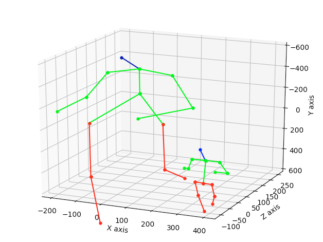

# 3d-pose-baseline

## Input

2d vector * 16 : (1, 32)

## Output

3d vector * 16 : (1, 48)

## Input Image

(Image from https://pixabay.com/ja/photos/%E5%A5%B3%E3%81%AE%E5%AD%90-%E7%BE%8E%E3%81%97%E3%81%84-%E8%8B%A5%E3%81%84-%E3%83%9B%E3%83%AF%E3%82%A4%E3%83%88-5204299/)

## Output Image

## Reference

[A simple baseline for 3d human pose estimation in tensorflow. Presented at ICCV 17.](https://github.com/una-dinosauria/3d-pose-baseline)

## Framework

Tensorflow 1.13.1

## Model Format

ONNX opset = 10

## Netron

[3d-pose-baseline.onnx.prototxt](https://netron.app/?url=https://storage.googleapis.com/ailia-models/3d-pose-baseline/3d-pose-baseline.onnx.prototxt)
