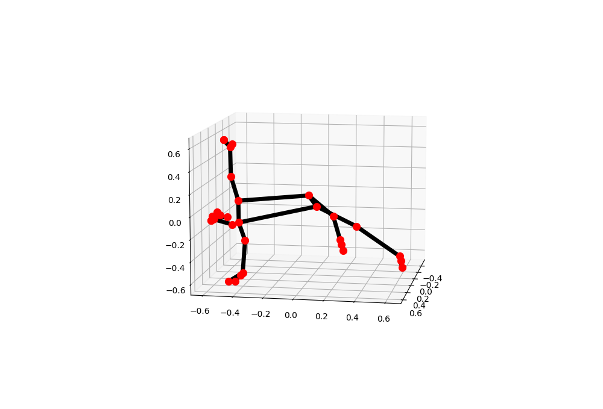

# MediaPipe Pose World Landmarks

## Input


(Image from https://mediapipe.page.link/pose_py_colab)

## Output

### POSE_LANDMARKS


### POSE_WORLD_LANDMARKS



## Usage
Automatically downloads the onnx and prototxt files on the first run.
It is necessary to be connected to the Internet while downloading.

For the sample image,
```bash
$ python3 mediapipe_pose_world_landmarks.py
```

If you want to specify the input image, put the image path after the `--input` option.  
You can use `--savepath` option to change the name of the output file to save.
```bash
$ python3 mediapipe_pose_world_landmarks.py --input IMAGE_PATH --savepath SAVE_IMAGE_PATH
```

By adding the `--video` option, you can input the video.   
If you pass `0` as an argument to VIDEO_PATH, you can use the webcam input instead of the video file.
```bash
$ python3 mediapipe_pose_world_landmarks.py --video VIDEO_PATH
```

By adding the `--model` option, you can specify model type which is selected from "lite", "full", "heavy".  
(default is heavy)
```bash
$ python3 mediapipe_pose_world_landmarks.py --model heavy
```

By specifying the `--world_landmark` option, POSE_WORLD_LANDMARKS plot is drawn.
```bash
$ python3 mediapipe_pose_world_landmarks.py --world_landmark
```

## Reference

- [MediaPipe](https://github.com/google/mediapipe)
- [MediaPipe Pose real-world 3D coordinates](https://google.github.io/mediapipe/solutions/pose.html#pose_world_landmarks)

## Framework

TensorFlow Lite

## Model Format

ONNX opset=12

## Netron

[pose_detection.onnx.prototxt](https://netron.app/?url=https://storage.googleapis.com/ailia-models/mediapipe_pose/pose_detection.onnx.prototxt)  
[pose_landmark_lite.onnx.prototxt](https://netron.app/?url=https://storage.googleapis.com/ailia-models/mediapipe_pose/pose_landmark_lite.onnx.prototxt)  
[pose_landmark_full.onnx.prototxt](https://netron.app/?url=https://storage.googleapis.com/ailia-models/mediapipe_pose/pose_landmark_full.onnx.prototxt)  
[pose_landmark_heavy.onnx.prototxt](https://netron.app/?url=https://storage.googleapis.com/ailia-models/mediapipe_pose/pose_landmark_heavy.onnx.prototxt)
