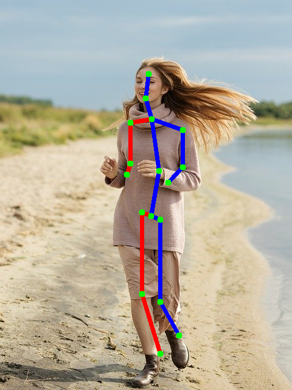
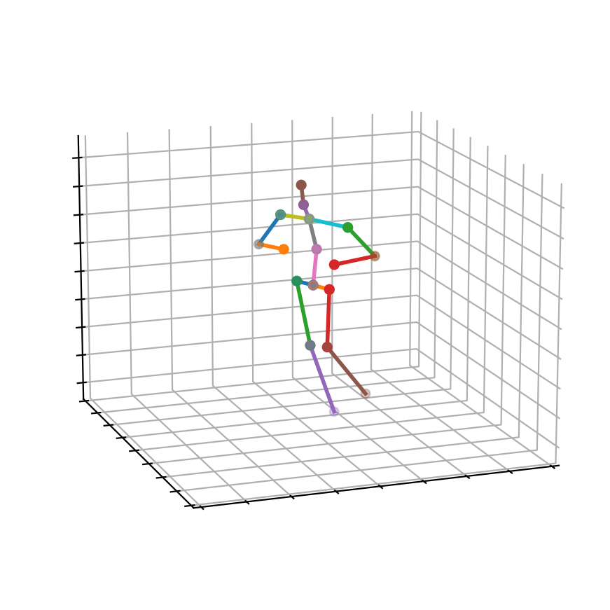

# Exploiting Temporal Contexts with Strided Transformer for 3D Human Pose Estimation

## Input


Ailia input shape: (1, 3, 416, 416)

## Output





## Usage

Automatically downloads the onnx and prototxt files on the first run.
It is necessary to be connected to the Internet while downloading.

For the sample image,
``` bash
$ python3 strided_transformer_pose3d.py
```

If you want to specify the input image, put the image path after the `--input` option.  
You can use `--savepath` option to change the name of the output file to save.
```bash
$ python3 strided_transformer_pose3d.py --input IMAGE_PATH --savepath SAVE_IMAGE_PATH
```

By adding the `--video` option, you can input the video.   
If you pass `0` as an argument to VIDEO_PATH, you can use the webcam input instead of the video file.
```bash
$ python3 strided_transformer_pose3d.py --video VIDEO_PATH
```

The default setting is to use the optimized model and weights, but you can also switch to the normal model by using the --normal option.

## Reference

[Exploiting Temporal Contexts with Strided Transformer for 3D Human Pose Estimation](https://github.com/Vegetebird/StridedTransformer-Pose3D)

## Framework

Pytorch

## Model Format

ONNX opset = 12

## Netron

[yolox_tiny.opt.onnx.prototxt](https://netron.app/?url=https://storage.googleapis.com/ailia-models/yolox/yolox_tiny.opt.onnx.prototxt)

[hrnet_w48-8ef0771d.opt.onnx.prototxt](https://netron.app/?url=https://storage.googleapis.com/ailia-models/strided_transformer_pose3d/hrnet_w48-8ef0771d.opt.onnx.prototxt)

[no_refine_4365.opt.onnx.prototxt](https://netron.app/?url=https://storage.googleapis.com/ailia-models/strided_transformer_pose3d/no_refine_4365.opt.onnx.prototxt)