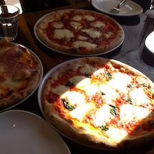

# Resnet50

## Input



Shape : (1,3,224,224)
Range : [-127.0, 127.0]

## Output

```
+ idx=0
  category=963[ pizza, pizza pie ]
  prob=0.8783312439918518
+ idx=1
  category=927[ trifle ]
  prob=0.04941209405660629
+ idx=2
  category=567[ frying pan, frypan, skillet ]
  prob=0.011235987767577171
```

## Reference

[Deep Residual Learning for Image Recognition]( https://github.com/KaimingHe/deep-residual-networks)

## Model Format

ONNX opset = 10

## Framework

Chainer 6.3.0

## Netron

[resnet50.onnx.prototxt](https://lutzroeder.github.io/netron/?url=https://storage.googleapis.com/ailia-models/resnet50/resnet50.onnx.prototxt)

[resnet50.opt.onnx.prototxt](https://lutzroeder.github.io/netron/?url=https://storage.googleapis.com/ailia-models/resnet50/resnet50.opt.onnx.prototxt)

[resnet50_pytorch.onnx.prototxt](https://lutzroeder.github.io/netron/?url=https://storage.googleapis.com/ailia-models/resnet50/resnet50_pytorch.onnx.prototxt)
