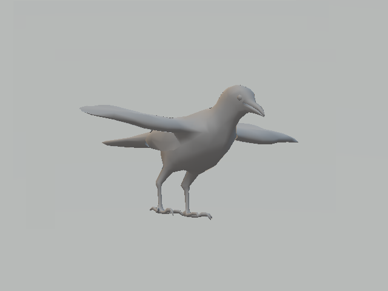
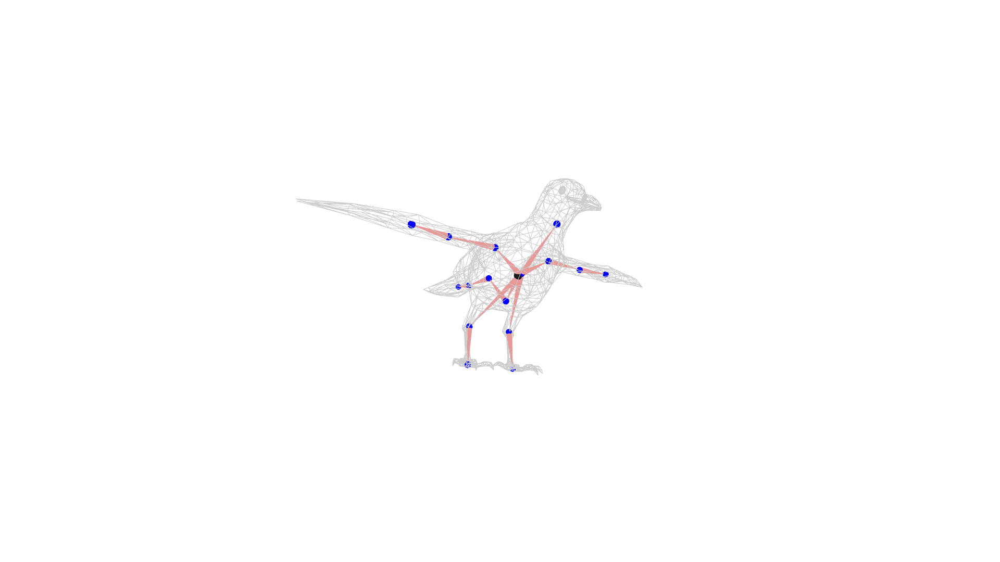

# RigNet

## Input



(File from https://github.com/zhan-xu/RigNet/blob/master/quick_start/17872_remesh.obj)

## Output



## Setup

The following commands installs pytorch1.7.1 and pytorch_geometric1.7.1.

``` bash
$ source setup.sh
```

For Windows,
run `pip install -r requirements.txt -f https://download.pytorch.org/whl/torch_stable.html -f https://pytorch-geometric.com/whl/torch-1.7.0+cpu.html`
. Then you need to download Windows-compiled Rtree from [here](https://www.lfd.uci.edu/~gohlke/pythonlibs/#rtree), and
install it by `pip install Rtree‑0.9.4‑cp37‑cp37m‑win_amd64.whl` (64-bit system)
or `pip install Rtree‑0.9.4‑cp37‑cp37m‑win32.whl` (32-bit system).

## Usage

Automatically downloads the onnx and prototxt files on the first run. It is necessary to be connected to the Internet
while downloading.

For the sample object,

``` bash
$ python3 rignet.py
```

The predicted rigs are saved as *_rig.txt. Due to randomness, the results might be slightly different among each run.

If you want to specify the input object, put the object file path after the `--input` option.  
You can use `--savepath` option to change the name of the output file to save.

```bash
$ python3 rignet.py --input FILE_PATH --savepath SAVE_IMAGE_PATH
```

If you want to try your own models, remember to simplify the meshes so that the remeshed ones have vertices between 1K
to 5K.

You can specify bandwidth and threshold parameter.

``` bash
$ python3 rignet.py --threshold 0.75e-5 --bandwidth 0.045
```

## Reference

- [RigNet](https://github.com/zhan-xu/RigNet)

## Framework

Pytorch

## Model Format

ONNX opset=11
