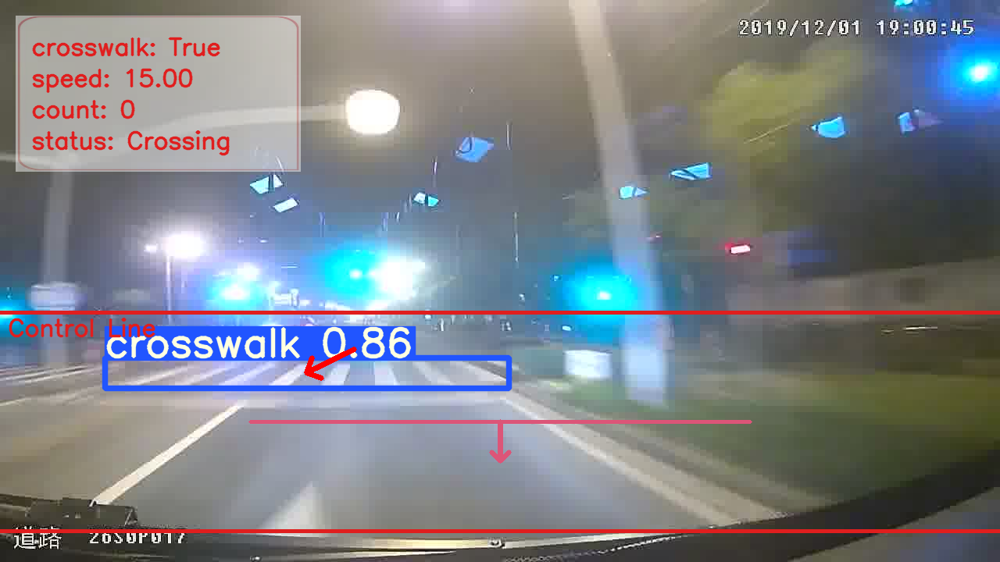

# CDNet

## Input


(Image from https://github.com/zhangzhengde0225/CDNet/tree/master/example/images)

## Output



If you input a video or multiple images, 
in addition to the bounding box, the result of the vector crossing method is drawn. 

## Usage
Automatically downloads the onnx and prototxt files on the first run.
It is necessary to be connected to the Internet while downloading.

For the sample image,
```bash
$ python3 cdnet.py --input example --savepath output
```

If you want to specify the input image, put the image path after the `--input` option.  
You can use `--savepath` option to change the name of the output file to save.
```bash
$ python3 cdnet.py --input IMAGE_PATH --savepath SAVE_IMAGE_PATH
```

By adding the `--video` option, you can input the video.   
If you pass `0` as an argument to VIDEO_PATH, you can use the webcam input instead of the video file.
```bash
$ python3 cdnet.py --video VIDEO_PATH
```

## Reference

- [CDNet](https://github.com/zhangzhengde0225/CDNet)

## Framework

Pytorch

## Model Format

ONNX opset=11

## Netron

[cdnet.onnx.prototxt](https://netron.app/?url=https://storage.googleapis.com/ailia-models/cdnet/cdnet.onnx.prototxt)
