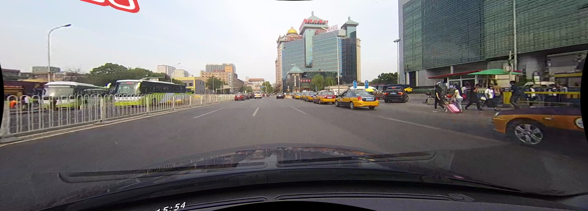
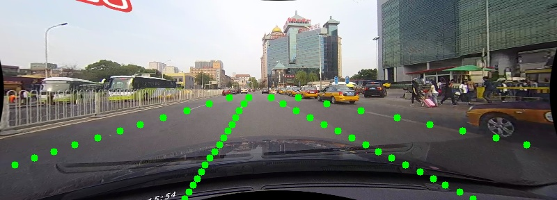

# Ultra-Fast-Lane-Detection

## Input



(Image from https://github.com/czming/RONELD-Lane-Detection/tree/main/example/00000.jpg)

Input shape: (1, 288, 800, 3)

## Output



## Usage

Automatically downloads the onnx and prototxt files on the first run. It is necessary to be connected to the Internet
while downloading.

For the sample image,

``` bash
$ python3 ultra-fast-lane-detection.py
```

If you want to specify the input image, put the image path after the `--input` option.  
You can use `--savepath` option to change the name of the output file to save.

```bash
$ python3 ultra-fast-lane-detection.py --input IMAGE_PATH --savepath SAVE_IMAGE_PATH
```

By adding the `--video` option, you can input the video.   
If you pass `0` as an argument to VIDEO_PATH, you can use the webcam input instead of the video file.

```bash
$ python3 ultra-fast-lane-detection.py --video VIDEO_PATH
```

By adding the `--arch` option, you can select the model architecture from `culane` and `tusimple`. 

## Reference

[Ultra-Fast-Lane-Detection](https://github.com/cfzd/Ultra-Fast-Lane-Detection)

## Framework

Pytorch


## Model Format

ONNX opset = 11

## Netron

[tusimple_18.onnx.prototxt](https://netron.app/?url=https://storage.googleapis.com/ailia-models/ultra-fast-lane-detection/tusimple_18.onnx.prototxt)

[culane_18.onnx.prototxt](https://netron.app/?url=https://storage.googleapis.com/ailia-models/ultra-fast-lane-detection/culane_18.onnx.prototxt)