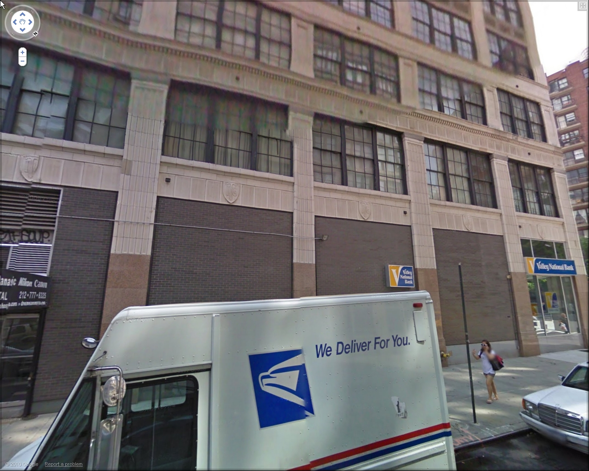

# RotNet

### input


(from https://github.com/d4nst/RotNet/tree/master/data/test_examples)

Shape(1, 224, 224, 3) (automatically croped in the script)

### output
- Original: original image (after cropped)
- Rotated: input image (randomly rotated)
- Corrected: output image (model output is predicted angle, therefore we rotated the "rotated image" to visualize our output)


### Usage
two models are avilable
- mnist(for mnist dataset)
- gsv2(for google street view dataset)

```bash
python3 rotnet.py --model gsv2
```

### Reference
[RotNet](https://github.com/d4nst/RotNet)

### Framework
Keras

### Model Format
ONNX opset = 10
