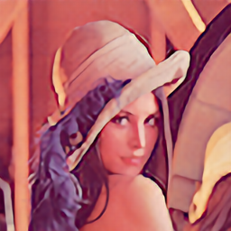

# SRResNet

## Input

Shape : (1,3,64,64)
Range : [0.0, 1.0]

## Output

Shape : (1,3,256,256)
Range : [0, 1.0]

## Reference

[Photo-Realistic Single Image Super-Resolution Using a Generative Adversarial Network](https://github.com/twtygqyy/pytorch-SRResNet)

## Framework

Pytorch 1.2.0

## Model Format

ONNX opset = 10

## Netron

[srresnet.onnx.prototxt](https://lutzroeder.github.io/netron/?url=https://storage.googleapis.com/ailia-models/srresnet/srresnetn.onnx.prototxt)

[srresnet.opt.onnx.prototxt](https://lutzroeder.github.io/netron/?url=https://storage.googleapis.com/ailia-models/srresnet/srresnet.opt.onnx.prototxt)

