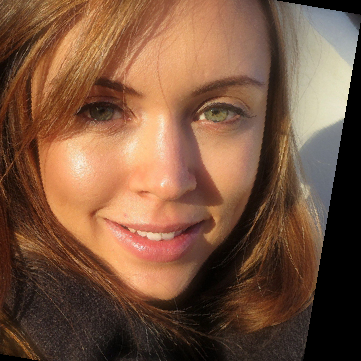
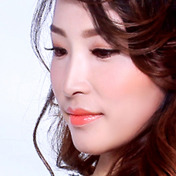

# BeautyGAN

## Input

- non-makeup  

  
- makeup  


(Image from BeautyGAN dataset http://colalab.org/projects/BeautyGAN)

## Output


## Usage

Automatically downloads the onnx and prototxt files on the first run.
It is necessary to be connected to the Internet while downloading.

For the sample image,

``` bash
$ python3 beauty_gan.py
```

If you want to specify the input image (non-makeup), put the image path after the `--input` option.  
You can use `--savepath` option to change the name of the output file to save.

```bash
$ python3 beauty_gan.py --input IMAGE_PATH --savepath SAVE_IMAGE_PATH
```

You can use `--image_makeup` option to specify the makeup image file.

```bash
$ python3 beauty_gan.py --image_makeup IMAGE_PATH
```

By adding the `--video` option, you can input the video.   
If you pass `0` as an argument to VIDEO_PATH, you can use the webcam input instead of the video file.

```bash
$ python3 beauty_gan.py --video VIDEO_PATH --savepath SAVE_VIDEO_PATH
```

## Reference

- [BeautyGAN](https://github.com/wtjiang98/BeautyGAN_pytorch)

## Framework

Pytorch

## Model Format

ONNX opset=11

## Netron

[G_ep300.onnx.prototxt](https://netron.app/?url=https://storage.googleapis.com/ailia-models/beauty_gan/G_ep300.onnx.prototxt)
