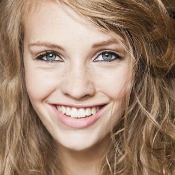
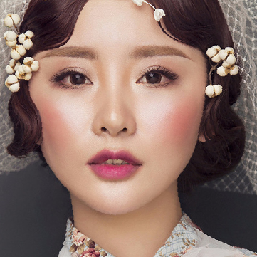
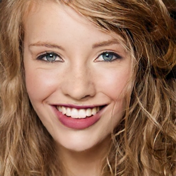

# EleGANt: Exquisite and Locally Editable GAN for Makeup Transfer


### input
- input image (1x3x361x361)



(These images from https://github.com/Chenyu-Yang-2000/EleGANt/blob/main/assets/images/non-makeup/source_1.png)

- style image (1x3x361x361) 



(These images from https://github.com/Chenyu-Yang-2000/EleGANt/tree/main/assets/images/makeup/reference_1.png)

### output (1x3x361x361)



### usage
Automatically downloads the onnx and prototxt files on the first run.
It is necessary to be connected to the Internet while downloading.

For the sample image,
``` bash
$ python3 elegant.py
```

If you want to specify the input image, put the image path after the `--input` option.  
Style image can be specified with the `--reference` option.  
You can use `--savepath` option to change the name of the output file to save.
```bash
$ python3 elegant.py --input IMAGE_PATH --reference STYLE_IMAGE_PATH --savepath SAVE_IMAGE_PATH
```

By adding the `--video` option, you can input the video and convert it by the style image.
If you pass `0` as an argument to VIDEO_PATH, you can use the webcam input instead of the video file.
```bash
$ python3 elegant.py --video VIDEO_PATH --reference STYLE_IMAGE_PATH
```

If you want to run with onnxruntime instead of ailia, you can use `--onnx` option as below.

```
$ python3 elegant.py --onnx
```

By adding the `--use_dlib` option, you can use original version of face and landmark detection.

### Reference

[EleGANt: Exquisite and Locally Editable GAN for Makeup Transfer](https://github.com/Chenyu-Yang-2000/EleGANt)


### Framework

PyTorch = 2.2.0

### Model Format

ONNX opset = 16

### Netron

- [elegant.onnx.prototxt](https://netron.app/?url=https://storage.googleapis.com/ailia-models/EleGANt/elegant.onnx.prototxt)
