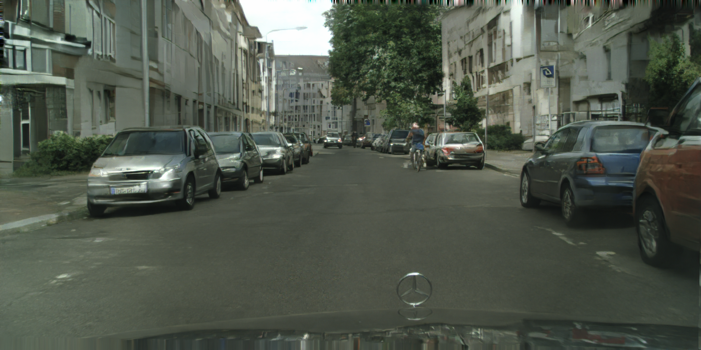

# pix2pixHD

## Input

Notice: The current streetview model need both label map and instance map as input, since the original pytorch model was trained with both maps as input.

### Input label map


### Input instance map


Standard shape of 2 maps: (1, 1024, 2048, 1) grayscale, in the format B, H, W, C

If input shape is not matched, it will be reshaped to : (1, 1024, 2048, 1) 

(Images from https://www.cityscapes-dataset.com/)

## Output



## Usage
Automatically downloads the onnx and prototxt files on the first run.
It is necessary to be connected to the Internet while downloading.

For the sample image,
``` bash
$ python3 pix2pixhd.py
```

If you want to specify the input label map and instance map, put the label image path and instance image map after the `--input` and `--instance_map` options respectively.
You can use `--savepath` option to change the name of the output file to save.
```bash
$ python3 pix2pixhd.py --input IMAGE_PATH --instance_map INSTANCE_PATH --savepath SAVE_IMAGE_PATH
```

## Reference

- [pix2pixHD](https://github.com/NVIDIA/pix2pixHD)

## Framework

PyTorch

## Model Format

ONNX opset=11

## Netron

[pix2pixhd.onnx.prototxt](https://netron.app/?url=https://storage.googleapis.com/ailia-models/pix2pixhd/pix2pixhd.onnx.prototxt)
