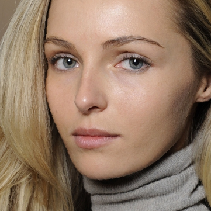
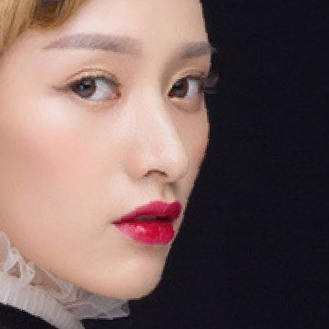

# PSGAN : Pose and Expression Robust Spatial-Aware GAN for Customizable Makeup Transfer


### input
- input image  


- style image  


(These images from https://github.com/wtjiang98/PSGAN/tree/master/assets/images)

### output


### usage
Automatically downloads the onnx and prototxt files on the first run.
It is necessary to be connected to the Internet while downloading.

For the sample image,
``` bash
$ python3 psgan.py
```

If you want to specify the input image, put the image path after the `--input` option.  
Style image can be specified with the `--reference_dir` option.  
You can use `--savepath` option to change the name of the output file to save.
```bash
$ python3 psgan.py --input IMAGE_PATH --reference_dir STYLE_DIRECTORY_PATH --savepath SAVE_IMAGE_PATH
```

By adding the `--video` option, you can input the video and convert it by the style image.
If you pass `0` as an argument to VIDEO_PATH, you can use the webcam input instead of the video file.
```bash
$ python3 psgan.py --video VIDEO_PATH --style STYLE_IMAGE_PATH
```

### Reference

[PSGAN : Pose and Expression Robust Spatial-Aware GAN for Customizable Makeup Transfer](https://github.com/wtjiang98/PSGAN)


### Framework
PyTorch


### Model Format
ONNX opset = 11


### Netron

- [psgan.onnx.prototxt](https://netron.app/?url=https://storage.googleapis.com/ailia-models/psgan/psgan.onnx.prototxt)
