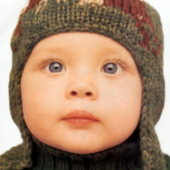

# RCAN-it

## Input



(Image from https://github.com/sanghyun-son/EDSR-PyTorch/blob/master/test/0853x4.png)

Ailia input shape : (1, 3, IMAGE_HEIGHT, IMAGE_WIDTH)  

## Output


Ailia output shape : (1, 3, IMAGE_HEIGHT * scale, IMAGE_WIDTH * scale)

default : scale=2

## Usage
Automatically downloads the onnx and prototxt files when running.
It is necessary to be connected to the Internet while downloading.

For the sample image with twice the resolution,
``` bash
$ python3 rcan-it.py
```

If you want to specify the input image, put the image path after the `--input` option.  
You can use `--savepath` option to change the name of the output file to save.
```bash
$ python3 rcan-it.py --input IMAGE_PATH --savepath SAVE_IMAGE_PATH
```

If you want to specify the scale for the resolution, put the scale after the `--scale` option.  
Choose the scale in [2, 3, 4].
```bash
$ python3 rcan-it.py --scale SCALE 
```


By adding the `--video` option, you can input the video.   
If you pass `0` as an argument to VIDEO_PATH, you can use the webcam input instead of the video file.

```bash
$ python3 rcan-it.py --video VIDEO_PATH
```


## Reference

[Revisiting RCAN: Improved Training for Image Super-Resolution](https://github.com/zudi-lin/rcan-it)

## Framework

Pytorch 1.11.0

## Model Format

ONNX opset = 12

## Netron

[rcan-it_scale2.onnx.prototxt](https://netron.app/?url=https://storage.googleapis.com/ailia-models/rcan-it/rcan-it_scale2.onnx.prototxt)

[rcan-it_scale3.onnx.prototxt](https://netron.app/?url=https://storage.googleapis.com/ailia-models/rcan-it/rcan-it_scale2.onnx.prototxt)

[rcan-it_scale4.onnx.prototxt](https://netron.app/?url=https://storage.googleapis.com/ailia-models/rcan-it/rcan-it_scale2.onnx.prototxt)
