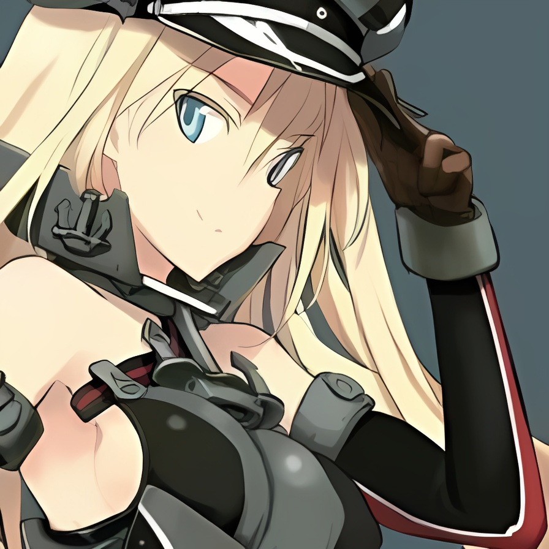

# Real-ESRGAN

## Input


(Image from https://github.com/xinntao/Real-ESRGAN/tree/master/inputs/ADE_val_00000114.jpg)


(Image from https://github.com/xinntao/Real-ESRGAN/blob/master/inputs/0030.jpg)

Ailia input shape: (1, 3, 256, 256)

## Output




## Usage

Automatically downloads the onnx and prototxt files on the first run. It is necessary to be connected to the Internet
while downloading.

For the sample image,

``` bash
$ python3 real_esrgan.py
```

You can also use an anime-specific super-resolution model by adding the -m RealESRGAN_anime option.

```bash
$ python3 real_esrgan.py -m RealESRGAN_anime -i input_anime.jpg -s output_anime.jpg
```

If you want to specify the input image, put the image path after the `--input` option.  
You can use `--savepath` option to change the name of the output file to save.

```bash
$ python3 real-esrgan.py --input IMAGE_PATH --savepath SAVE_IMAGE_PATH
```

By adding the `--video` option, you can input the video.   
If you pass `0` as an argument to VIDEO_PATH, you can use the webcam input instead of the video file.

```bash
$ python3 real_esrgan.py --video VIDEO_PATH
```

## Reference

[Real-ESRGAN](https://github.com/xinntao/Real-ESRGAN)

## Framework

Pytorch

## Model Format

ONNX opset = 12

## Netron

[RealESRGAN.opt.onnx.prototxt](https://netron.app/?url=https://storage.googleapis.com/ailia-models/real-esrgan/RealESRGAN.opt.onnx.prototxt)
