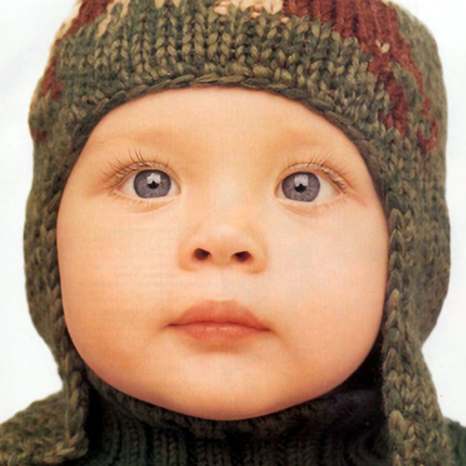

# Swift Parameter-free Attention Network for Efficient Super-Resolution

## Input


(Image from https://github.com/JingyunLiang/SwinIR/tree/main/testsets)

Ailia input shape : (1, 3, 256, 256)  

## Output



Ailia output shape : (1, 3, 256 * scale, 256 * scale)

default : scale=2

## Usage
Automatically downloads the onnx and prototxt files when running.
It is necessary to be connected to the Internet while downloading.

``` bash
$ python3 span.py
```

If you want to specify the input image, put the image path after the `--input` option.  
You can use `--savepath` option to cspange the name of the output file to save.
```bash
$ python3 span.py --input IMAGE_PATH --savepath SAVE_IMAGE_PATH
```

By adding the `--arch` option, you can specify model type which is selected from "span_ch48","span_ch52".  (default is span_ch48)
```bash
$ python3 span.py --arch span
```

If you want to specify the scale for the resolution, put the scale after the `--scale` option.  
Choose the scale in [2, 4].
```bash
$ python3 span.py --scale SCALE 
```


By adding the `--video` option, you can input the video.   
If you pass `0` as an argument to VIDEO_PATH, you can use the webcam input instead of the video file.

```bash
$ python3 span.py --video VIDEO_PATH
```


## Reference

[SPAN](https://github.com/hongyuanyu/SPAN)

## Framework

Pytorch 1.30.0

## Model Format

ONNX opset = 17

## Netron

[spanx2_ch48.onnx.prototxt](https://netron.app/?url=https://storage.googleapis.com/ailia-models/span/spanx2_ch48.onnx.prototxt)

[spanx2_ch52.onnx.prototxt](https://netron.app/?url=https://storage.googleapis.com/ailia-models/span/spanx2_ch48.onnx.prototxt)

[spanx4_ch48.onnx.prototxt](https://netron.app/?url=https://storage.googleapis.com/ailia-models/span/spanx2_ch48.onnx.prototxt)

[spanx4_ch52.onnx.prototxt](https://netron.app/?url=https://storage.googleapis.com/ailia-models/span/spanx2_ch48.onnx.prototxt)

