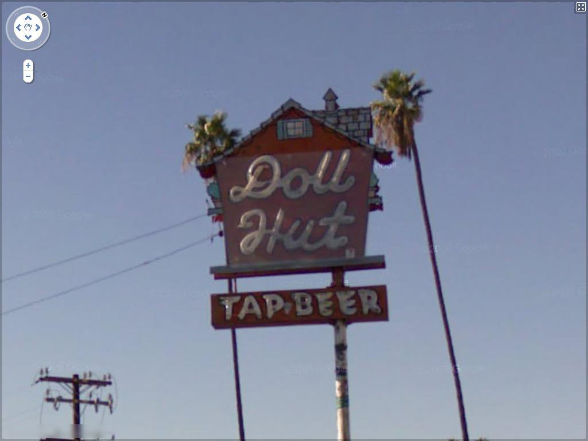

# CRAFT: Character-Region Awareness For Text detection


## Input



(Image above is from [http://www.iapr-tc11.org/mediawiki/index.php/The_Street_View_Text_Dataset](http://www.iapr-tc11.org/mediawiki/index.php/The_Street_View_Text_Dataset).)

## Output


## Usage
Automatically downloads the onnx and prototxt files on the first run.
It is necessary to be connected to the Internet while downloading.

For the sample image,
```
$ python3 craft-pytorch.py
```

If you want to specify the input image, put the image path after the `--input` option.  
You can use `--savepath` option to change the name of the output file to save.
```
$ python3 craft-pytorch.py --input IMAGE_PATH --savepath SAVE_IMAGE_PATH
```

By adding the `--video` option, you can input the video.   
If you pass `0` as an argument to VIDEO_PATH, you can use the webcam input instead of the video file.
```
$ python3 craft-pytorch.py --video VIDEO_PATH
```

## Reference

- [CRAFT: Character-Region Awareness For Text detection](https://github.com/clovaai/CRAFT-pytorch)

## Framework

PyTorch 0.4.1 or more

## Model Format

ONNX opset=10

## Netron

[craft.onnx.prototxt](https://netron.app/?url=https://storage.googleapis.com/ailia-models/craft-pytorch/craft.onnx.prototxt)

