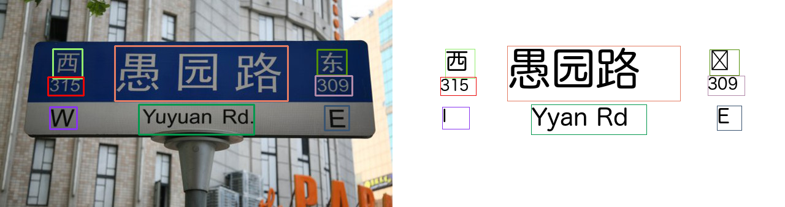

# EasyOCR
Ready-to-use OCR with 80+ supported languages and all popular writing scripts including Latin, Chinese, Arabic, Devanagari, Cyrillic and etc.

## Input


(from https://github.com/JaidedAI/EasyOCR/tree/master/examples)

## Output

recognized text and visualized image

```
  word=西 bbox=[[86, 80], [134, 80], [134, 128], [86, 128]] confidence=0.5982276948352592
  word=愚园路 bbox=[[187, 75], [469, 75], [469, 165], [187, 165]] confidence=0.7516731254579294
  word=东 bbox=[[517, 81], [565, 81], [565, 123], [517, 123]] confidence=0.9942460813641709
  word=315 bbox=[[78, 126], [136, 126], [136, 156], [78, 156]] confidence=0.9999935304043551
  word=309 bbox=[[514, 124], [574, 124], [574, 156], [514, 156]] confidence=0.9999759111084772
  word=I bbox=[[81, 175], [125, 175], [125, 211], [81, 211]] confidence=0.9417670402058889
  word=Yyan Rd bbox=[[226, 171], [414, 171], [414, 220], [226, 220]] confidence=0.6218364490642484
  word=E bbox=[[529, 173], [569, 173], [569, 213], [529, 213]] confidence=0.038355074509201836
```



## Usage

Automatically downloads the onnx and prototxt files on the first run.
It is necessary to be connected to the Internet while downloading.

For the sample image,
``` bash
$ python3 easyocr.py
```

If you want to specify the input image, put the image path after the `--input` option.  
You can use `--savepath` option to change the name of the output file to save.
```bash
$ python3 easyocr.py --input IMAGE_PATH
$ python3 easyocr.py -i IMAGE_PATH -s SAVE_IMAGE_PATH
```

By adding the `--video` option, you can input the video.   
If you pass `0` as an argument to VIDEO_PATH, you can use the webcam input instead of the video file.
```bash
$ python3 easyocr.py --video VIDEO_PATH
```

By adding the `--language` option, you can choose the language.
```bash
$ python3 easyocr.py --language LANGUAGE
$ python3 easyocr.py -l LANGUAGE
(ex) $ python3 easyocr.py --language chinese
(ex) $ python3 easyocr.py -l chinese
```

The prepared language are as follows.
  - chinese (default)
  - japanese
  - english
  - french
  - korean
  - thai


```bash
(ex) $ python3 easyocr.py --language chinese --input example/chinese.jpg
(ex) $ python3 easyocr.py --language japanese --input example/japanese.jpg
(ex) $ python3 easyocr.py --language english --input example/english.png
(ex) $ python3 easyocr.py --language french --input example/french.jpg
(ex) $ python3 easyocr.py --language korean --input example/korean.png
(ex) $ python3 easyocr.py --language thai --input example/thai.jpg
```

## Reference
[Jaided AI: EasyOCR demo](https://www.jaided.ai/easyocr/)    
[Ready-to-use OCR with 80+ supported languages and all popular writing scripts including Latin, Chinese, Arabic, Devanagari, Cyrillic and etc.](https://github.com/JaidedAI/EasyOCR)

## Framework
Pytorch    

## Model Format
ONNX opset = 11    

## Netron
[detector_craft.onnx.prototxt](https://netron.app/?url=https://storage.googleapis.com/ailia-models/easyocr/detector_craft.onnx.prototxt)   
[recognizer_zh_sim_g2.onnx.prototxt](https://netron.app/?url=https://storage.googleapis.com/ailia-models/easyocr/recognizer_zh_sim_g2.onnx.prototxt)    
[recognizer_japanese_g2.onnx.prototxt](https://netron.app/?url=https://storage.googleapis.com/ailia-models/easyocr/recognizer_japanese_g2.onnx.prototxt)    
[recognizer_english_g2.onnx.prototxt](https://netron.app/?url=https://storage.googleapis.com/ailia-models/easyocr/recognizer_english_g2.onnx.prototxt)    
[recognizer_latin_g2.onnx.prototxt](https://netron.app/?url=https://storage.googleapis.com/ailia-models/easyocr/recognizer_latin_g2.onnx.prototxt)    
[recognizer_korean_g2.onnx.prototxt](https://netron.app/?url=https://storage.googleapis.com/ailia-models/easyocr/recognizer_korean_g2.onnx.prototxt)    
[recognizer_thai.onnx.prototxt](https://netron.app/?url=https://storage.googleapis.com/ailia-models/easyocr/recognizer_thai.onnx.prototxt)      
