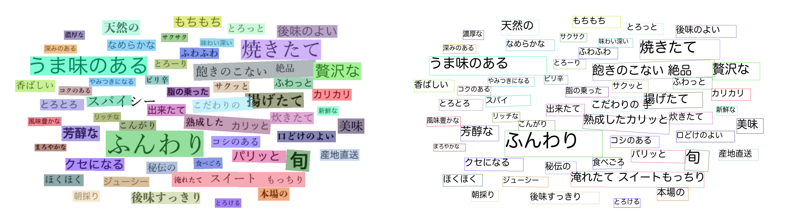

# PoseNet of "Camera Distance-aware Top-down Approach for 3D Multi-person Pose Estimation from a Single RGB Image"

### input


(from https://github.com/PaddlePaddle/PaddleOCR/tree/dygraph/doc/imgs)

### output


### usage
Automatically downloads the onnx and prototxt files on the first run.
It is necessary to be connected to the Internet while downloading.

For the sample image,
``` bash
$ python paddleocr.py
(ex on CPU)  $ python paddleocr.py -e 0
(ex on BLAS) $ python paddleocr.py -e 1
(ex on GPU)  $ python paddleocr.py -e 2
```

If you want to specify the input image, put the image path after the `--input` option.  
You can use `--savepath` option to change the name of the output file to save.
```bash
$ python3 paddleocr.py --input IMAGE_PATH --savepath SAVE_IMAGE_PATH
$ python3 paddleocr.py -i IMAGE_PATH -s SAVE_IMAGE_PATH
```

By adding the `--video` option, you can input the video.
```bash
$ python3 paddleocr.py --video VIDEO_PATH --savepath SAVE_VIDEO_PATH
$ python3 paddleocr.py -v VIDEO_PATH -s SAVE_VIDEO_PATH
(ex) $ python3 paddleocr.py --video input.mp4 --savepath output.mp4
```

### Reference

[PaddleOCR : Awesome multilingual OCR toolkits based on PaddlePaddle](https://github.com/PaddlePaddle/PaddleOCR/tree/dygraph/doc/imgs)
[PaddleOCR2Pytorch : PaddleOCR推理的pytorch实现和模型转换](https://github.com/frotms/PaddleOCR2Pytorch)


### Framework
Pytorch

### Model Format
ONNX opset = 10


### Netron

[ch_ppocr_server_v2.0_det_train.onnx.prototxt](https://netron.app/?url=https://storage.googleapis.com/ailia-models/paddle_ocr/ch_ppocr_server_v2.0_det_train.onnx.prototxt)
[ch_ppocr_mobile_v2.0_cls_train.onnx.prototxt](https://netron.app/?url=https://storage.googleapis.com/ailia-models/paddle_ocr/ch_ppocr_mobile_v2.0_cls_train.onnx.prototxt)
[japan_mobile_v2.0_rec_infer.onnx.prototxt](https://netron.app/?url=https://storage.googleapis.com/ailia-models/paddle_ocr/japan_mobile_v2.0_rec_infer.onnx.prototxt)
