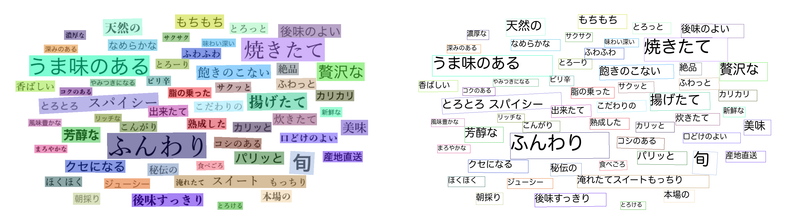

# PaddleOCR v3 : Awesome multilingual OCR toolkits based on PaddlePaddle

## Input


(from https://github.com/PaddlePaddle/PaddleOCR/tree/dygraph/doc/imgs)

<br/>

## Output



<br/>

## Usage

Automatically downloads the onnx and prototxt files on the first run.
It is necessary to be connected to the Internet while downloading.

For the sample image,
``` bash
$ python paddleocr_v3.py
(ex on CPU)  $ python paddleocr_v3.py -e 0
(ex on BLAS) $ python paddleocr_v3.py -e 1
(ex on GPU)  $ python paddleocr_v3.py -e 2
```

If you want to specify the input image, put the image path after the `--input` option.  
You can use `--savepath` option to change the name of the output file to save.
```bash
$ python3 paddleocr_v3.py --input IMAGE_PATH --savepath SAVE_IMAGE_PATH
$ python3 paddleocr_v3.py -i IMAGE_PATH -s SAVE_IMAGE_PATH
```

<br/>

By adding the `--video` option, you can input the video.
```bash
$ python3 paddleocr_v3.py --video VIDEO_PATH --savepath SAVE_VIDEO_PATH
$ python3 paddleocr_v3.py -v VIDEO_PATH -s SAVE_VIDEO_PATH
(ex) $ python3 paddleocr_v3.py --video input.mp4 --savepath output.mp4
```

<br/>

By adding the `--case` option, you can choose model size by case.
```bash
$ python3 paddleocr_v3.py --case CASE
$ python3 paddleocr_v3.py -c CASE
(ex) $ python3 paddleocr_v3.py --case mobile
```

The prepared language specifications are as follows.
  - mobile
  - server (default)

<br/>

By adding the `--det_limit_type` and `--det_limit_side_len` option, You can limit the size of the input image for text detection.
`--det_limit_type` is max or min and `--det_limit_side_len` is a positive integer, generally set to a multiple of 32, such as 960.
The default setting of the parameters is `--det_limit_type`='max', `--det_limit_side_len`=1920. Indicates that the longest side of the network input image cannot exceed 1920, If this value is exceeded, the image will be resized with the same width ratio to ensure that the longest side is det_limit_side_len.
Set as `--det_limit_type`='min', `--det_limit_side_len`=960 it means that the shortest side of the image is limited to 960.
```bash
$ python3 paddleocr_v3.py -lt DET_LIMIT_TYPE -ll DET_LIMIT_SIDE_LEN
$ python3 paddleocr_v3.py  --det_limit_type DET_LIMIT_TYPE --det_limit_side_len DET_LIMIT_SIDE_LEN
(ex) $ python3 paddleocr_v3.py -lt max -ll 1920
(ex) $ python3 paddleocr_v3.py  --det_limit_type min --det_limit_side_len 960
```

<br/>

## About font file

Requires Japanese font.
The default specification for each OS is as follows.

```
    if sys.platform == "win32":
        # Windows
        dc['vis_font_path'] = 'C:/windows/Fonts/meiryo.ttc'
    elif sys.platform == "darwin":
        # Mac OS
        dc['vis_font_path'] = '/System/Library/Fonts/ヒラギノ丸ゴ ProN W4.ttc'
    else:
        # Linux
        dc['vis_font_path'] = '/usr/share/fonts/opentype/ipaexfont-gothic/ipaexg.ttf'
```

If the Japanese font of the above path does not exist, please prepare it as described or change the specification in the program.
In case of linux, you can get the target font by executing the following command.

```
apt install fonts-ipaexfont
```

<br/>

## Reference

[PaddleOCR : Awesome multilingual OCR toolkits based on PaddlePaddle](https://github.com/PaddlePaddle/PaddleOCR)

<br/>

## Framework

Pytorch

<br/>

## Model Format

ONNX opset = 10

<br/>

## Netron

- [PP-OCRv5_mobile_det_infer.onnx.onnx.prototxt](https://netron.app/?url=https://storage.googleapis.com/ailia-models/paddle_ocr_v3/PP-OCRv5_mobile_det_infer.onnx.prototxt)
- [PP-OCRv5_mobile_rec_infer.onnx.prototxt](https://netron.app/?url=https://storage.googleapis.com/ailia-models/paddle_ocr_v3/PP-OCRv5_mobile_rec_infer.onnx.prototxt)
- [PP-OCRv5_server_det_infer.onnx.onnx.prototxt](https://netron.app/?url=https://storage.googleapis.com/ailia-models/paddle_ocr_v3/PP-OCRv5_server_det_infer.onnx.prototxt)
- [PP-OCRv5_server_rec_infer.onnx.prototxt](https://netron.app/?url=https://storage.googleapis.com/ailia-models/paddle_ocr_v3/PP-OCRv5_server_rec_infer.onnx.prototxt)
