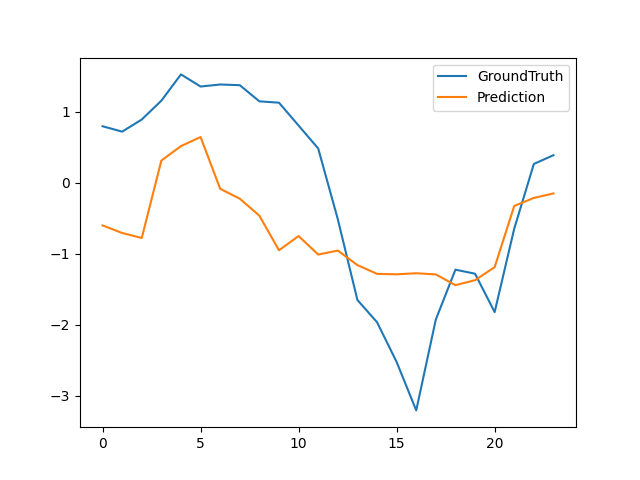
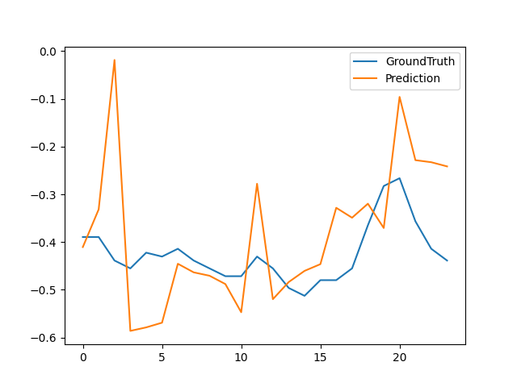

# Informer: Beyond Efficient Transformer for Long Sequence Time-Series Forecasting

## input
Time-series data (csv file of Electricity Transformer Dataset)

Dataset can be available from [Electricity Transformer Dataset (ETDataset)](https://github.com/zhouhaoyi/ETDataset)

## Output
Predicted time-series data and visualized images.

### Visalized image (HUFL feature)


### Visalized image (OT feature)


## Usage
Automatically downloads the onnx and prototxt files on the first run.
It is necessary to be connected to the Internet while downloading.

```bash
$ python3 informer2020.py
```

If you want to run with onnxruntime instead of ailia, you can use `--onnx` option as below.

```
$ python3 informer2020.py --onnx
```

You can specify model architecture by using `--model` option. Available models are `informer` and `informerstack`. (default is `informer`.)

```
$ python3 informer2020.py --model [MODEL_TYPE]
```

You can specify dataset which had been used to train model by using `--data` option. 
Available datasets are `ETTh1` and `ETTm1`. (default is `ETTh1`.)

```
$ python3 informer2020.py --data [DATASET_TYPE]
```

## Reference

- [Informer: Beyond Efficient Transformer for Long Sequence Time-Series Forecasting (AAAI'21 Best Paper)](https://github.com/zhouhaoyi/Informer2020)
- [Electricity Transformer Dataset (ETDataset)](https://github.com/zhouhaoyi/ETDataset)

## Framework

Pytorch

## Model Format

ONNX opset=14

## Netron

[informer_ETTh1.onnx.prototxt](https://netron.app/?url=https://storage.googleapis.com/ailia-models/informer2020/informer_ETTh1.onnx.prototxt)

[informer_ETTm1.onnx.prototxt](https://netron.app/?url=https://storage.googleapis.com/ailia-models/informer2020/informer_ETTm1.onnx.prototxt)

[informerstack_ETTh1.onnx.prototxt](https://netron.app/?url=https://storage.googleapis.com/ailia-models/informer2020/informerstack_ETTh1.onnx.prototxt)

[informerstack_ETTm1.onnx.prototxt](https://netron.app/?url=https://storage.googleapis.com/ailia-models/informer2020/informerstack_ETTm1.onnx.prototxt)