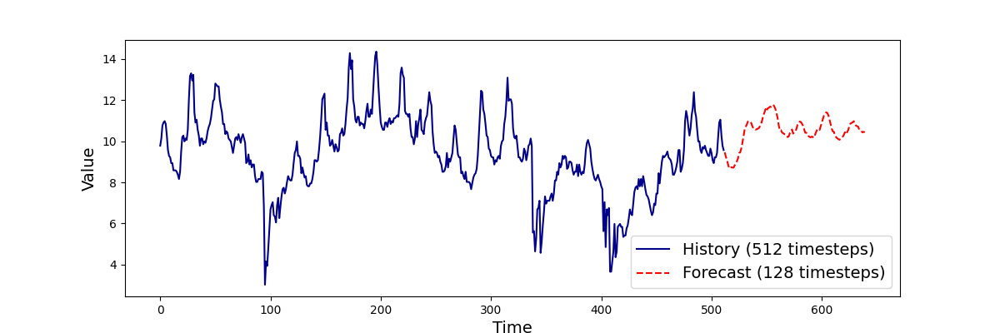

# Informer: Beyond Efficient Transformer for Long Sequence Time-Series Forecasting

## Input
Time-series data (csv file of Electricity Transformer Dataset)

Dataset can be available from [Electricity Transformer Dataset (ETDataset)](https://github.com/zhouhaoyi/ETDataset)

## Output



## Usage
Automatically downloads the onnx and prototxt files on the first run.
It is necessary to be connected to the Internet while downloading.

```bash
$ python3 timesfm.py
```

You can specify dataset which had been used to train model by using `--input` option. 
You can use `--savepath` option to change the name of the output file to save.
```bash
$ python3 timesfm.py --input CSV_FILE --savepath SAVE_IMAGE_PATH
```

Use the `--target` option to specify the columns to forecast from the data file.
In addition to column names, you can also specify column indexes.
```bash
$ python3 timesfm.py --target OT
```

Specify the length given to the model with the `--context_len` option,
and the predicted length with the `--horizon_len` option.
```bash
$ python3 timesfm.py --context_len 512 --horizon_len 128
```

The `--forecast_len` option specifies the length of data to use for validation from the end of the data.
```bash
$ python3 timesfm.py --forecast_horizon 128
```

## Reference

- [Hugging Face - google/timesfm-1.0-200m](https://huggingface.co/google/timesfm-1.0-200m)

## Framework

Pytorch

## Model Format

ONNX opset=17

## Netron

[timesfm-1.0-200m.onnx.prototxt](https://netron.app/?url=https://storage.googleapis.com/ailia-models/timesfm/timesfm-1.0-200m.onnx.prototxt)
