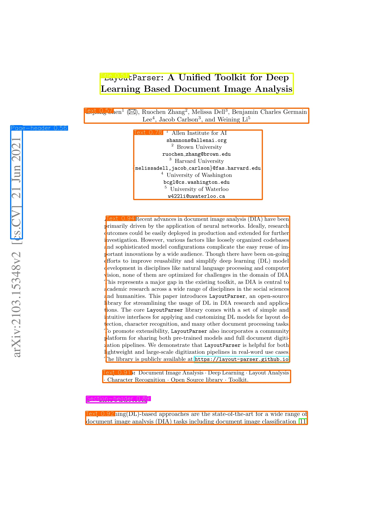

# Unstructured inference (Layout parsing)
## Input
Input is a PDF file which you want to parse layout. sample.pdf is a sample pdf.


## Output
Outputs are images with bounding boxes.



## Usage
Automatically downloads the onnx and prototxt files on the first run. It is necessary to be connected to the Internet while downloading.

For sample pdf, 
```
$ python layout_parsing.py --savepath <image folder> --detector
```

If you want to specify input pdf, 
```
$ python lauout_parsing.py --savepath <image folder> --input xxx.pdf --detector
```

## Reference
- [Original repository](https://github.com/Unstructured-IO/unstructured-inference/tree/main)

## Framework
PyTorch

## Model format
ONNX opset = 11

## Netron
- [layout_parsing_yolox.onnx.prototxt](https://netron.app/?url=https://storage.googleapis.com/ailia-models/layout-parsing/layoyt_parsing_yolox.onnx.prototxt)
