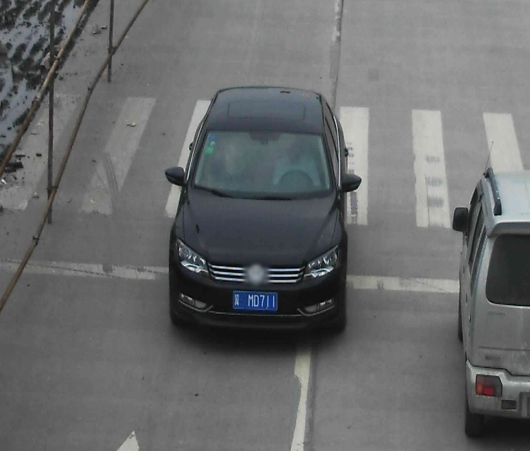

# vehicle-license-plate-detection-barrier

## Input



(Image from https://github.com/openvinotoolkit/open_model_zoo/blob/master/models/intel/vehicle-license-plate-detection-barrier-0106/assets/vehicle-license-plate-detection-barrier-0106.jpeg)

Shape: (1, 300, 300, 3) BGR channel order

## Output


## Usage
Automatically downloads the onnx and prototxt files on the first run.
It is necessary to be connected to the Internet while downloading.

For the sample image,
```bash
$ python3 vehicle-license-plate-detection-barrier.py
```

If you want to specify the input image, put the image path after the `--input` option.  
You can use `--savepath` option to change the name of the output file to save.
```bash
$ python3 vehicle-license-plate-detection-barrier.py --input IMAGE_PATH --savepath SAVE_IMAGE_PATH
```

By adding the `--video` option, you can input the video.   
If you pass `0` as an argument to VIDEO_PATH, you can use the webcam input instead of the video file.
```bash
$ python3 vehicle-license-plate-detection-barrier.py --video VIDEO_PATH
```

## Reference

- [OpenVINO - Open Model Zoo repository - vehicle-license-plate-detection-barrier-0106](https://github.com/openvinotoolkit/open_model_zoo/tree/master/models/intel/vehicle-license-plate-detection-barrier-0106)
- [OpenVINO - vehicle-license-plate-detection-barrier-0106](https://docs.openvinotoolkit.org/latest/omz_models_model_vehicle_license_plate_detection_barrier_0106.html)

## Framework

OpenVINO

## Model Format

ONNX opset=11

## Netron

[vehicle-license-plate-detection-barrier-0106.onnx.prototxt](https://netron.app/?url=https://storage.googleapis.com/ailia-models/vehicle-license-plate-detection-barrier/vehicle-license-plate-detection-barrier-0106.onnx.prototxt)