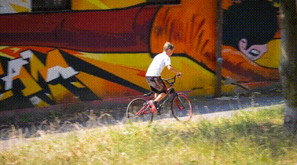

# FuseFormer: Fusing Fine-Grained Information in Transformers for Video Inpainting

## Input



(Video from https://github.com/sczhou/ProPainter/tree/main/inputs/object_removal/bmx-trees)


(Image from https://github.com/sczhou/ProPainter/blob/main/inputs/object_removal/bmx-trees_mask/00000.png)

## Output


## Usage
Automatically downloads the onnx and prototxt files on the first run.
It is necessary to be connected to the Internet while downloading.

For the sample video,
``` bash
$ python3 fuseformer.py
```

If you want to specify the input video or input frames, put the video path or the input frames folder after the `--video` option. <br>
If you want to specify the input masked frames, put the input masked frames folder after the `--mask` option. <br>
You can use `--savepath` option to change the name of the output folder to save.
```bash
$ python3 fuseformer.py --video VIDEO_OR_FRAMES_PATH --mask MASKED_FRAMES_PATH --savepath SAVE_FOLDER_PATH
```

You can use `--width` and `--height`, or the `--resize_ratio` options to change the video resolution.
```bash
$ python3 fuseformer.py --width 432 --height 240
```

By adding the `--save_frames` option, you can save the output video frames.
```bash
$ python3 fuseformer.py --save_frames
```

By adding the `--onnx` option, you can run the inference using OnnxRuntime.
```bash
$ python3 fuseformer.py --onnx
```

## Reference

- [FuseFormer](https://github.com/ruiliu-ai/FuseFormer)

## Framework

Pytorch

## Model Format

ONNX opset = 18

## Netron

- [fuseformer.onnx.prototxt](https://netron.app/?url=https://storage.googleapis.com/ailia-models/fuseformer/fuseformer.onnx.prototxt)
