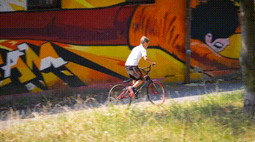

# ProPainter

## Input



(Video from https://github.com/sczhou/ProPainter/tree/main/inputs/object_removal/bmx-trees)


(Image from https://github.com/sczhou/ProPainter/blob/main/inputs/object_removal/bmx-trees_mask/00000.png)

## Output

TBD

## Usage
Automatically downloads the onnx and prototxt files on the first run.
It is necessary to be connected to the Internet while downloading.

For the sample video,
``` bash
$ python3 propainter.py
```

If you want to specify the input video or input frames, put the video path or the input frames folder after the `--video` option. <br>
If you want to specify the input masked frames, put the input masked frames folder after the `--mask` option. <br>
You can use `--savepath` option to change the name of the output folder to save.
```bash
$ python3 propainter.py --video VIDEO_OR_FRAMES_PATH --mask MASKED_FRAMES_PATH --savepath SAVE_FOLDER_PATH
```

You can use `--width` and `--height`, or the `--resize_ratio` options to change the video resolution.
```bash
$ python3 propainter.py --width 432 --height 240
```

By adding the `--save_frames` option, you can save the output video frames.
```bash
$ python3 propainter.py --save_frames
```

By adding the `--onnx` option, you can run the inference using OnnxRuntime.
```bash
$ python3 propainter.py --onnx
```

## Reference

- [ProPainter](https://github.com/sczhou/ProPainter)

## Framework

Pytorch

## Model Format

ONNX opset = 18

Models can be downloaded from [ax Drive](https://drive.google.com/file/d/1rDtVFYQv-PKGM85oR5bEcfMCW6FN5AWt/view?usp=sharing).

## Problem

The models were exported from PyTorch using `opset=18` as they use the operator `aten::col2im`, so they do not run with ailia SDK for now (only ONNX Runtime).

The model `propainter.onnx` was successfully exported from PyTorch to ONNX, and can be visualized in Netron, but cannot be read by ONNXRuntime. <br>
Error details:
```bash
onnxruntime.capi.onnxruntime_pybind11_state.Fail: [ONNXRuntimeError] : 1 : FAIL : Load model from propainter.onnx failed:Node (/transformers/transformer.0/attention/max_pool/MaxPool) Op (MaxPool) [ShapeInferenceError] Attribute dilations has incorrect size
```

## Netron

- [raft.onnx.prototxt](https://netron.app/?url=https://storage.googleapis.com/ailia-models/fuseformer/raft.onnx.prototxt)
- [complete_flow.onnx.prototxt](https://netron.app/?url=https://storage.googleapis.com/ailia-models/fuseformer/complete_flow.onnx.prototxt)
- [image_propagation.onnx.prototxt](https://netron.app/?url=https://storage.googleapis.com/ailia-models/fuseformer/image_propagation.onnx.prototxt)
- [propainter.onnx.prototxt](https://netron.app/?url=https://storage.googleapis.com/ailia-models/fuseformer/propainter.onnx.prototxt)
