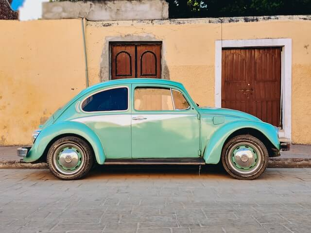
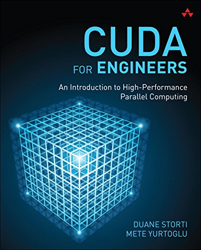
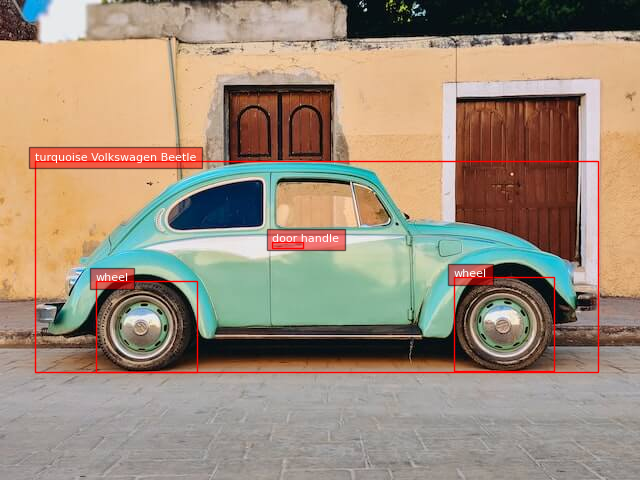
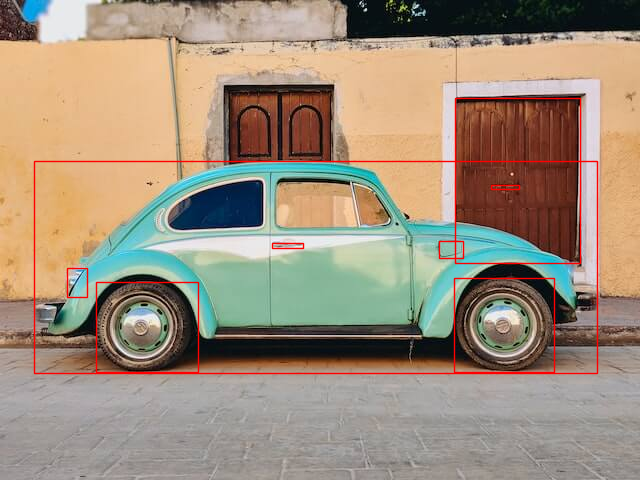
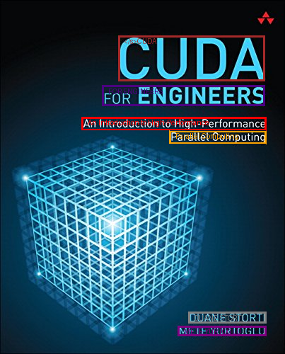

# Florence-2

## Input



(Image from https://huggingface.co/datasets/huggingface/documentation-images/resolve/main/transformers/tasks/car.jpg)



(Image from http://ecx.images-amazon.com/images/I/51UUzBDAMsL.jpg)


## Output

### Caption

- prompt: CAPTION

    ```
    {'<CAPTION>': 'A green car parked in front of a yellow building.'}
    ```

### Detailed Caption

- prompt: DETAILED_CAPTION

    ```
    {'<DETAILED_CAPTION>': 'The image shows a green Volkswagen Beetle parked in front of a yellow building with two brown doors, surrounded by trees and a clear blue sky.'}
    ```

### More Detailed Caption

- prompt: DETAILED_CAPTION

    ```
    {'<MORE_DETAILED_CAPTION>': 'The image shows a vintage Volkswagen Beetle car parked on a cobblestone street in front of a yellow building with two wooden doors. The car is a light blue color with a white stripe running along the side. It has a round body and a small rear window. The wheels are silver with black rims. The building appears to be old and dilapidated, with peeling paint and crumbling walls. The sky is blue and there are trees in the background.'}
    ```

### Caption to Phrase Grounding

- prompt: DETAILED_CAPTION
- text_input "A green car parked in front of a yellow building."

    ```
    {'<CAPTION_TO_PHRASE_GROUNDING>': {'bboxes': [[35.52, 159.12, 582.72, 375.12], [0.32, 0.24, 639.04, 305.03999999999996]], 'labels': ['A green car', 'a yellow building']}}
    ```

### Object Detection

- prompt: OD

    ```
    {'<OD>': {'bboxes': [[34.24, 160.07999999999998, 597.44, 371.76], [272.32, 241.67999999999998, 303.68, 247.44], [454.08, 276.71999999999997, 553.92, 370.8], [96.32000000000001, 280.56, 198.08, 371.28]], 'labels': ['car', 'door handle', 'wheel', 'wheel']}}
    ```

    

### Dense Region Caption

- prompt: DENSE_REGION_CAPTION

    ```
    {'<DENSE_REGION_CAPTION>': {'bboxes': [[34.24, 160.07999999999998, 597.44, 371.76], [453.44, 276.71999999999997, 553.28, 370.8], [95.04, 280.56, 196.8, 371.28], [271.68, 241.67999999999998, 302.40000000000003, 247.44]], 'labels': ['turquoise Volkswagen Beetle', 'wheel', 'wheel', 'door handle']}
    ```

    

### Region proposal

- prompt: REGION_PROPOSAL

    ```
    {'<REGION_PROPOSAL>': {'bboxes': [[33.6, 160.56, 596.8000000000001, 372.24], [454.72, 97.67999999999999, 579.52, 262.32], [95.04, 281.03999999999996, 197.44, 371.76], [453.44, 277.2, 553.28, 371.28], [66.24, 267.59999999999997, 86.72, 296.4], [438.08, 240.23999999999998, 462.40000000000003, 257.52], [271.68, 242.16, 302.40000000000003, 247.92], [490.56, 184.56, 518.08, 188.4]], 'labels': ['', '', '', '', '', '', '', '']}}
    ```

    

### OCR

- prompt: OCR

    ```
    {'<OCR>': 'CUDAFOR ENGINEERSAn Introduction to High-PerformanceParallel ComputingDUANE STORTIMETE YURTOGLU'}
    ```

### OCR with Region

- prompt: OCR_WITH_REGION

    ```
    {'<OCR_WITH_REGION>': {'quad_boxes': [[167.04350000000002, 50.25, 374.99150000000003, 50.25, 374.99150000000003, 114.25, 167.04350000000002, 114.25], [144.8785, 120.75, 374.99150000000003, 120.75, 374.99150000000003, 149.25, 144.8785, 149.25], [115.86250000000001, 165.25, 376.20050000000003, 165.25, 376.20050000000003, 184.25, 115.86250000000001, 183.25], [239.58350000000002, 184.25, 376.20050000000003, 185.25, 376.20050000000003, 203.75, 239.58350000000002, 202.75], [266.1815, 440.75, 376.20050000000003, 440.75, 376.20050000000003, 456.25, 266.1815, 456.25], [251.67350000000002, 460.25, 376.20050000000003, 460.25, 376.20050000000003, 474.75, 251.67350000000002, 474.75]], 'labels': ['</s>CUDA', 'FOR ENGINEERS', 'An Introduction to High-Performance', 'Parallel Computing', 'DUANE STORTI', 'METE YURTOGLU']}}
    ```

    

## Usage
Automatically downloads the onnx and prototxt files on the first run.
It is necessary to be connected to the Internet while downloading.

For the sample image,
```bash
$ python3 florence2.py
```

If you want to specify the input image, put the image path after the `--input` option.  
You can use `--savepath` option to change the name of the output file to save.
```bash
$ python3 florence2.py --input IMAGE_PATH --savepath SAVE_IMAGE_PATH
```

If you want to specify the prompt, put the prompt after the `--prompt` option.  
```bash
$ python3 florence2.py --prompt PROMPT
```

For DETAILED_CAPTION, specify the Text image file after the `--text_input` option.
```bash
$ python3 florence2.py --prompt DETAILED_CAPTION --text_input TEXT_INPUT
```

## Reference

- [Hugging Face - microsoft/Florence-2-base](https://huggingface.co/microsoft/Florence-2-base)
- [Hugging Face - microsoft/Florence-2-large](https://huggingface.co/microsoft/Florence-2-large)

## Framework

Pytorch

## Model Format

ONNX opset=17

## Netron

[embeddings_base.onnx.prototxt](https://netron.app/?url=https://storage.googleapis.com/ailia-models/florence2/embeddings_base.onnx.prototxt)  
[feature_base.onnx.prototxt](https://netron.app/?url=https://storage.googleapis.com/ailia-models/florence2/feature_base.onnx.prototxt)  
[encoder_base.onnx.prototxt](https://netron.app/?url=https://storage.googleapis.com/ailia-models/florence2/encoder_base.onnx.prototxt)  
[decoder_base.onnx.prototxt](https://netron.app/?url=https://storage.googleapis.com/ailia-models/florence2/decoder_base.onnx.prototxt)

[embeddings_large.onnx.prototxt](https://netron.app/?url=https://storage.googleapis.com/ailia-models/florence2/embeddings_large.onnx.prototxt)  
[feature_large.onnx.prototxt](https://netron.app/?url=https://storage.googleapis.com/ailia-models/florence2/feature_large.onnx.prototxt)  
[encoder_large.onnx.prototxt](https://netron.app/?url=https://storage.googleapis.com/ailia-models/florence2/encoder_large.onnx.prototxt)  
[decoder_large.onnx.prototxt](https://netron.app/?url=https://storage.googleapis.com/ailia-models/florence2/decoder_large.onnx.prototxt)

