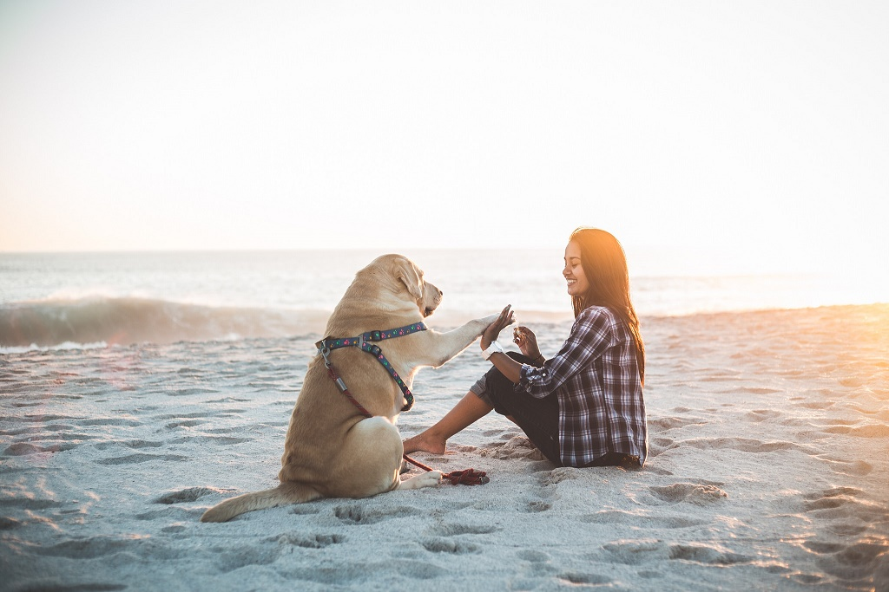

# Qwen2-VL-2B

## Input

- Image

  

  (Image from https://qianwen-res.oss-cn-beijing.aliyuncs.com/Qwen-VL/assets/demo.jpeg)

- Prompt

  Describe this image.

## Output

The image depicts a serene beach scene with a woman and a dog. The woman is sitting on the sand, wearing a plaid shirt and black pants, and appears to be smiling. She is giving a high-five to the dog, which is sitting on the sand next to her. The dog is wearing a colorful harness and appears to be wagging its tail. The background shows the ocean with gentle waves, and the sky is clear with a soft glow, suggesting either sunrise or sunset. The overall atmosphere is peaceful and joyful.

## Requirements

This model requires additional module.

```
pip install git+https://github.com/huggingface/transformers@21fac7abba2a37fae86106f87fcf9974fd1e3830
```

## Usage
Automatically downloads the onnx and prototxt files on the first run.
It is necessary to be connected to the Internet while downloading.

For the sample image,
```bash
$ python3 qwen2_vl.py
```

If you want to specify the input image, put the image path after the `--input` option.  
```bash
$ python3 qwen2_vl.py --input IMAGE_PATH --prompt "Describe this image."
```

```bash
$ python3 qwen2_vl.py --input IMAGE_PATH IMAGE_PATH2 --prompt "Identify the similarities between these images."
```

By adding the `--video` option, you can input the video.   
```bash
$ python3 qwen2_vl.py --video VIDEO_PATH --prompt "Describe this video."
```

If you want to specify the prompt, put the prompt after the `--prompt` option.  
```bash
$ python3 qwen2_vl.py --prompt PROMPT
```

## Reference

- [Qwen2-VL](https://github.com/QwenLM/Qwen2-VL)

## Framework

Pytorch

## Model Format

ONNX opset=17

## Netron

[Qwen2-VL-2B_vis.onnx.prototxt](https://netron.app/?url=https://storage.googleapis.com/ailia-models/qwen2_vl/Qwen2-VL-2B_vis.onnx.prototxt)  
[Qwen2-VL-2B.onnx.prototxt](https://netron.app/?url=https://storage.googleapis.com/ailia-models/qwen2_vl/Qwen2-VL-2B.onnx.prototxt)  
