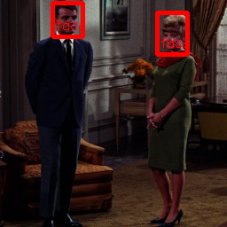

# yolov1-face

## Input

Shape : (1, 3, 448, 448)
Range : [-0.5, 0.5]

## Output

- probablity : [0.0,1.0]
- position : x, y, w, h [0,1]

## Reference

- [YOLO-Face-detection](https://github.com/dannyblueliu/YOLO-Face-detection)
- [convert between pytorch, caffe prototxt/weights and darknet cfg/weights](https://github.com/marvis/pytorch-caffe-darknet-convert)

## Framework

Darknet

## Model Format

CaffeModel
