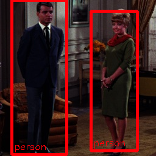

# yolov1-tiny

## Input

Shape : (1, 3, 448, 448)
Range : [-1.0, 1.0]

## Output

- category : [0,19]
- probablity : [0.0,1.0]
- position : x, y, w, h [0,1]

## Reference

- [YOLO: Real-Time Object Detection](https://pjreddie.com/darknet/yolov1/)
- [convert between pytorch, caffe prototxt/weights and darknet cfg/weights](https://github.com/marvis/pytorch-caffe-darknet-convert)

## Framework

Darknet

## Model Format

CaffeModel

## Netron

[yolov1-tiny.prototxt](https://lutzroeder.github.io/netron/?url=https://storage.googleapis.com/ailia-models/yolov1-tiny/yolov1-tiny.prototxt)
