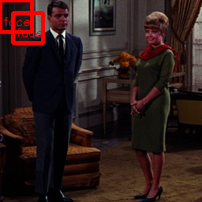

# yolov3-face

## Input

Shape : (1, 3, 448, 448)
Range : [0.0, 1.0]

## Output

- category : [0,0]
- probablity : [0.0,1.0]
- position : x, y, w, h [0,1]

## Reference

- [Face detection using keras-yolov3](https://github.com/axinc-ai/yolov3-face)

## Framework

Keras 2.2.4

## Model Format

ONNX opset=10
