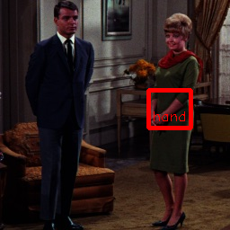

# yolov3-hand

## Input


Shape : (1, 3, 448, 448)
Range : [0.0, 1.0]

## Output



- category : [0,1]
- probablity : [0.0,1.0]
- position : x, y, w, h [0,1]

## Usage

Predict from image

```
python3 yolov3-hand.py
```

Predict from web camera

```
python3 yolov3-hand.py video
```

## Reference

- [Hand detection branch of Face detection using keras-yolov3](https://github.com/axinc-ai/yolov3-face/tree/hand_detection)

## Framework

Keras 2.2.4

## Model Format

ONNX opset=10

## Netron

[yolov3-hand.opt.onnx.prototxt](https://lutzroeder.github.io/netron/?url=https://storage.googleapis.com/ailia-models/yolov3-hand/yolov3-hand.opt.onnx.prototxt)

